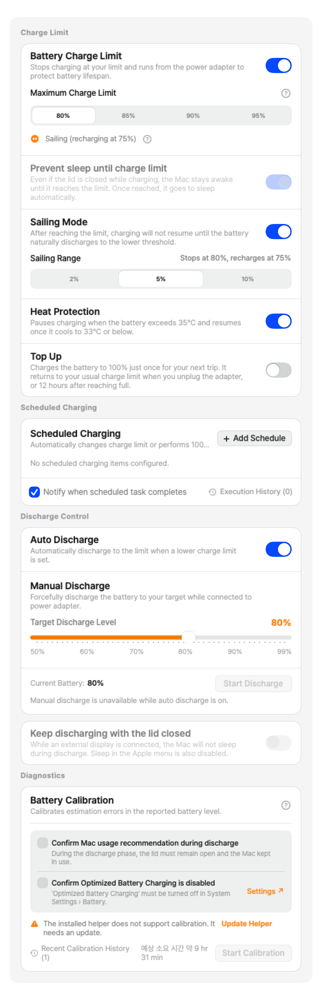

[한국어](README.md) | **English**

<p align="center">
  
</p>

<h1 align="center">Wattly</h1>

<p align="center">
  <em>An ultra-lightweight system telemetry, battery health manager & intelligent fan controller designed from scratch in pure Swift for Apple Silicon Macs.</em>
</p>

<p align="center">
  <a href="#installation-guide"><strong>Installation Guide</strong></a> &nbsp;&bull;&nbsp;
  <a href="#key-features"><strong>Key Features</strong></a> &nbsp;&bull;&nbsp;
  <a href="#hardware-level-telemetry-breakdown"><strong>Telemetry</strong></a> &nbsp;&bull;&nbsp;
  <a href="#battery-health--charge-management"><strong>Battery Health</strong></a> &nbsp;&bull;&nbsp;
  <a href="#smart-fan-curve-editor--thermal-control"><strong>Smart Fan Control</strong></a> &nbsp;&bull;&nbsp;
  <a href="#apple-shortcuts-integration--automation"><strong>Shortcuts Automation</strong></a> &nbsp;&bull;&nbsp;
  <a href="https://github.com/jjundev/project_wattly/releases"><strong>Latest Releases (DMG / ZIP)</strong></a>
</p>

---

## Overview

**Wattly** is a native menu bar system monitor, battery health manager, and intelligent fan controller designed completely from scratch for Apple Silicon Macs (M1, M2, M3, M4, and M5 across all tiers). Engineered in **Swift 6** with strict concurrency and built with **SwiftUI**, Wattly maintains near-zero CPU and battery overhead while delivering milliwatt-precision SoC power telemetry, per-cluster CPU/GPU performance breakdown, kernel memory pressure monitoring, real-time battery analytics and charging control, customizable smart fan curves, and Apple Shortcuts automation.

<p align="center">
  
</p>

### Key Features

- **Pure Swift 6 & Native SwiftUI**: Zero third-party runtime dependencies, zero Electron overhead, and completely eliminates unnecessary Metal GPU wakeups.
- **Zero-Privilege Telemetry**: Read-only telemetry operates 100% in standard user-space via `IOReport`, AppleSMC read keys, Mach kernel APIs, and IOHID. Standard monitoring requires zero root privileges or background daemons.
- **Battery Health Suite**: 80%~95% customizable Charge Limit, Sailing Mode (natural discharge delta band), 35°C Heat Protection, One-Time Top-Up, auto and manual forced Discharge via `CHIE`, and scheduled charging with intelligent Catch-up policy.
- **Apple Shortcuts & App Intents Integration**: Full automation for checking battery status, setting charge limits, toggling Sailing mode, and starting top-ups via Siri and the Shortcuts app.
- **App-Identity Intelligent Process Grouping**: Powered by the `AppIdentity` engine to group multi-instance processes by Bundle Identifier (`CFBundleIdentifier`) and display accurate user-facing application names (`CFBundleDisplayName`).
- **Milliwatt (mW) Precision SoC Power Breakdown**: Continuous per-engine power tracking for CPU, GPU, and Apple Neural Engine (ANE) via private `IOReport` Energy Model subscriptions with 4-second EMA smoothing.
- **Microarchitecture CPU & GPU Metrics**: Super, Performance (P), and Efficiency (E) core cluster utilization, real-time clock frequencies (GHz), GPU 3D Renderer and Tiler utilization, and unified Metal VRAM allocations.
- **True System Net Discharge**: Accurate whole-system power draw (including display, SSD, Wi-Fi, and audio) computed from AppleSMC voltage and amperage telemetry with signed 64-bit two's complement decoding.
- **Smart Fan Curves & Hardware Warnings**: Zero-RPM hysteresis hold zone (48°C~55°C), relative fan load percentage (70% caution / 90% danger) threshold warnings based on `FanSample.loadPercent`, watchdog failsafes, and Verified Release hardware recovery.
- **30+ Global Languages & Developer Feedback**: Localized in 30+ languages including Korean, English, Japanese, and Chinese, with one-click diagnostic reporting via browser-based Gmail compose.
- **Adaptive Polling Engine**: Automatically throttles sampling frequency (1–2s when popover is open, 2–5s when closed in background) to guarantee negligible self-power consumption (<0.05W).

---

## Popover Presentation Modes

Wattly adapts to your workflow with three carefully designed popover presentation layouts:

| Mode A: Stacked Cards | Mode B: Compact Grid | Mode C: Hero + List |
| :---: | :---: | :---: |
|  |  |  |
| **Deep-Dive Overview**<br/>Expandable cards with 60-second telemetry sparklines and process rankings. | **High-Density Dashboard**<br/>2-column compact metric tiles for immediate at-a-glance status. | **Focus Telemetry**<br/>Prominent hero metric (e.g. SoC Total Watts) with detailed sub-metrics. |

---

## Hardware-Level Telemetry Breakdown

Each telemetry domain in Wattly expands into a dedicated diagnostic card with real-time metrics, historical trends, and process attribution.

### 1. Processor Power SoC Breakdown
<p align="center">
  
</p>

- **Real-Time Engine Power (W)**: Continuous power tracking for CPU, GPU, and Apple Neural Engine (ANE) via private `IOReport` Energy Model channels at milliwatt precision.
- **Top Power Consumers**: Real-time process ranking via `BundleMetadataCache` memoization, tracking foreground and background apps without unnecessary disk I/O.
- **EMA Filtered Trends**: 4-second time-constant exponential moving average (EMA) filters eliminate sensor jitter while maintaining rapid transient response.

### 2. CPU Cluster Architecture & Frequency
<p align="center">
  
</p>

- **Topology-Aware Core Gauges**: Dynamic runtime core mapping via `sysctl` (`hw.perflevel`) accurately identifies Super, Performance (P), and Efficiency (E) clusters and renders per-core utilization gauges.
- **Per-Core Utilization**: High-resolution tick snapshot differentials via `host_processor_info(PROCESSOR_CPU_LOAD_INFO)`.
- **Live Frequency Scaling**: Instantaneous active clock frequencies (GHz) tracked per cluster.

### 3. GPU Pipeline & Unified VRAM
<p align="center">
  
</p>

- **3D Renderer & Tiler Utilization**: Dual-pipeline activity tracking reflecting real graphics rendering and compute workloads.
- **GPU Core Clock**: Real-time GPU core operating frequency monitoring.
- **Unified Metal VRAM Allocation**: Dedicated Metal memory tracking displaying dynamic in-use memory alongside total reserved VRAM heap.

### 4. Unified Memory & Memory Pressure
<p align="center">
  
</p>

- **Kernel Virtual Memory Breakdown**: Precise categorization of Active, Wired, Compressed, and Swap pages via `host_statistics64(HOST_VM_INFO64)`.
- **Memory Pressure Index**: Color-coded system memory pressure gauge indicating macOS paging headroom.
- **App-Identity Physical Footprint Attribution**: Unlike raw virtual memory listings, the `AppIdentity` engine groups multi-process instances by `CFBundleIdentifier` and attributes true physical footprint (`phys_footprint`) with human-readable application names (`CFBundleDisplayName`).

### 5. Battery & Power Telemetry
<p align="center">
  
</p>

- **System Net Discharge (W)**: Derived from AppleSMC `B0AP` / `B0AV` × `B0AC` registers with signed 64-bit two's complement decoding—capturing total system draw including display backlight, SSD, Wi-Fi, and audio amplifier.
- **1-Minute EMA Rate**: Smoothed discharge estimation for reliable, stable remaining runtime calculation.
- **Health & Capacity Telemetry**: Real-time remaining capacity (mAh/Wh), maximum capacity health percentage, cycle count, charging status, and bus voltage/amperage.

### 6. Cluster Thermals & Hotspots
<p align="center">
  
</p>

- **Multi-Sensor Thermal Aggregation**: Direct hardware readings across P-Core clusters, E-Core clusters, and GPU silicon across the entire M1 through M5 lineup.
- **Peak Hotspot Detection**: Automatic maximum sensor identification to pinpoint silicon thermal bottlenecks in real time.
- **Thermal Headroom Monitoring**: Proactive monitoring preventing unexpected OS thermal throttling during sustained compilation or render workloads.

---

## Battery Health & Charge Management

Wattly provides a complete Battery Management Suite to prevent high-voltage chemical degradation and thermal stress on lithium-ion batteries during continuous AC adapter usage.

<p align="center">
  
</p>

### 1. Charge Limit
- **Customizable Charge Ceiling**: Select desired battery charge thresholds such as 80%, 85%, 90%, or 95%.
- **Adapter AC Bypass**: Once the configured charge limit is reached, Wattly closes the battery charging gate via SMC registers (`CHTE` / `CH0B` / `BCLM`) and powers your Mac purely from the AC adapter, eliminating battery wear and heat generation.
- **Single Write on State Transition**: Avoids polling-loop SMC writes by updating registers only on discrete state transitions, preventing `PowerLog` wakeups and CPU overhead.

### 2. Sailing Mode (Floating Charge Prevention)
- **Eliminating Micro-cycling**: Prevents the damaging micro-charge cycles that occur when a battery constantly tops up every time it drops by 1%.
- **Natural Discharge Band (2%, 5%, 10%)**: Maintains system power purely on AC adapter current while allowing the battery to naturally discharge within the user-defined delta band (e.g., 80% limit + 5% Sailing = discharge down to 75% before resuming charge).

### 3. 35°C Heat Protection (Thermal Hysteresis)
- **High-Temperature Charge Cutoff**: Automatically pauses charging whenever the battery temperature exceeds 35°C to prevent thermal battery degradation.
- **Safe Cooling Hysteresis**: Applies a 2°C hysteresis band, resuming charging only after the battery has cooled down to 33°C or lower to eliminate rapid charge cycling.

### 4. One-Time Top-Up
- **One-Click 100% Charge for Travel**: Temporarily charges the battery to 100% before travel or meetings without modifying your established charge limit preferences.
- **Dual Automatic Restoration**: Reverts to your configured charge limit (e.g., 80%) as soon as the power adapter is unplugged. Even if you stay plugged in, the helper ends Top Up on its own 12 hours after reaching 100% and notifies you — so leaving it on by accident never parks the battery at 100% indefinitely.

### 5. Auto & Manual Forced Discharge (Discharge Control)
- **Forced Discharge on AC Power**: Employs SMC `CHIE` register control to draw power from the battery even while plugged in, safely draining the battery to your target level.
- **Auto Discharge**: When lowering your charge limit below current battery level (e.g., from 90% down to 80%), Wattly automatically discharges the battery to the new threshold.
- **Manual Discharge**: Set a custom target level (50%–100%) via slider and initiate immediate discharge with live wattage (-W) and estimated time to completion.

### 6. Scheduled Charging
- **Time-Based Custom Routines**: Schedule charge limits and top-ups by day of the week and time (e.g., charge to 100% at 8:00 AM on weekdays, pause charging overnight).
- **Intelligent Catch-up Policy**: If your Mac was asleep when a scheduled event was set to fire, Wattly intelligently catches up and applies the scheduled policy within 30 minutes of waking.

---

## Smart Fan Curve Editor & Thermal Control

Wattly features a precision multi-point fan curve engine designed to keep your Apple Silicon Mac quiet during light workflows and cool under sustained heavy loads.

<p align="center">
  
</p>

### Key Capabilities

- **Interactive Control Points**: Customize temperature-to-RPM thresholds across the entire operational range via mouse dragging or keyboard input.
- **Zero-RPM Hysteresis Zone**: Built-in 48°C–55°C hysteresis band eliminates annoying fan start/stop cycling during light bursts of activity.
- **Optimized Tuning Presets**:
  - **Silent**: Maintains 0 RPM up to 55°C and low acoustic RPM up to 65°C for silent operation.
  - **Balanced**: Standard linear curve maintaining optimal balance between acoustic comfort and component longevity.
  - **Performance**: Aggressive ramp-up keeping thermals below 75°C during heavy compilation or gaming workloads.
  - **Manual Override**: Direct RPM lock for specific benchmarking or thermal profiling.
- **Fan Load % Threshold Warnings**: Computes `FanSample.loadPercent` relative to each Mac model's specific maximum RPM (4,000–7,000 RPM), providing Caution (70%) and Danger (90%) visual highlights in the menu bar and popover.
- **Hardware-Level Safety Protections**:
  - Emergency override to 100% maximum RPM if silicon temperature exceeds 100°C.
  - **Verified Release**: Upon daemon exit, sensor read failure, or 15-second heartbeat watchdog timeout, hardware registers are read back to confirm safe, complete handover to macOS kernel automatic fan control.

---

## Apple Shortcuts Integration & Automation

Wattly integrates natively with Apple Shortcuts and Siri using the modern **App Intents** framework. Automate battery management and telemetry queries directly from the Shortcuts app without needing complex system scripting.

### Supported App Intents

| Intent Name | Description | Parameters |
| :--- | :--- | :--- |
| `GetBatteryStatusIntent` | Retrieves comprehensive battery metrics (SOC %, charging state, live net power in Watts, temperature in °C, health %, etc.) | None |
| `GetBatteryLimitIntent` | Retrieves current charge limit percentage, limit enabled status, and Sailing mode state | None |
| `SetBatteryLimitIntent` | Sets maximum charge limit and toggles charge limiting on or off | `limit` (50–100%), `enableLimit` (Bool) |
| `SetBatteryHeatProtectionIntent` | Toggles 35°C battery thermal protection and configures temperature threshold | `enabled` (Bool), `thresholdCelsius` (30–45°C) |
| `SetBatterySailingIntent` | Configures Sailing mode state and natural discharge delta band | `enabled` (Bool), `delta` (1–10%) |
| `SetBatteryTopUpIntent` | Initiates or cancels a one-time 100% Top-Up charge before departure | `start` (Bool) |

### Real-World Automation Examples

- **Morning Commute Top-Up Routine**:
  - *Trigger*: Alarm dismissed at 7:00 AM on weekdays
  - *Action*: Run `SetBatteryTopUpIntent(start: true)` &rarr; Tops up battery to 100% before commuting, then automatically restores the standard 80% limit when unplugged — or 12 hours after reaching full, whichever comes first.
- **Docked Office Workspace Mode**:
  - *Trigger*: Connected to office Wi-Fi network or "Work" Focus Mode enabled
  - *Action*: Run `SetBatteryLimitIntent(limit: 80, enableLimit: true)` and `SetBatterySailingIntent(enabled: true, delta: 5)` &rarr; Protects battery longevity during extended AC adapter usage.
- **Heavy Workload Thermal Protection**:
  - *Trigger*: Prior to running large compilation builds or video rendering jobs
  - *Action*: Run `SetBatteryHeatProtectionIntent(enabled: true, thresholdCelsius: 35)` &rarr; Prevents high-temperature charging degradation.

---

## Architecture & Zero-Privilege Security Model

Wattly implements a strict separation of concerns to guarantee maximum security, stability, and system performance.

<p align="center">
  
</p>

1. **Unprivileged Telemetry Pipeline (Reader)**:
   - Operates 100% within unprivileged user-space.
   - Consumes energy counters via `libIOReport.dylib`, sensor temperatures via SMC read keys, memory statistics via `host_statistics64`, processor ticks via `host_processor_info`, and `AppIntents` Shortcuts requests.
   - Requires zero helper tools, no `sudo` privileges, and no System Integrity Protection (SIP) modifications.

2. **Isolated Helper Daemon (`WattlyHelperDaemon` / `dev.jjundev.WattlyFanDaemon`)**:
   - Registered as a `launchd` system service via a single, secure administrator authorization prompt only when fan control or battery charge limiting is explicitly enabled.
   - Strictly limited to writing fan target RPM registers (`F0Tg`, `F0md`) and battery SMC registers (`CHTE`, `CH0B`/`CH0C`, `CHIE`, `BCLM`).
   - Communication is secured via local XPC MachService with audit-token UID verification and a 15-second heartbeat watchdog.
   - **Verified Release**: On daemon shutdown or unexpected termination, SMC registers are read back to verify that hardware control has been cleanly restored to macOS defaults.

---

## Apple Silicon Compatibility Table

Wattly is built specifically for Apple Silicon architecture, supporting all generations and tiers (Base, Pro, Max, and Ultra from M1 through M5):

| Generation | Base Chip | Pro Chip | Max Chip | Ultra Chip | Charge Control Mechanism | macOS Compatibility |
| :--- | :---: | :---: | :---: | :---: | :---: | :---: |
| **Apple M1 Series** | M1 | M1 Pro | M1 Max | M1 Ultra | Legacy `CH0B`/`CH0C` & Modern `CHTE` | macOS 14.0+ (Sonoma) / 15.0+ (Sequoia) |
| **Apple M2 Series** | M2 | M2 Pro | M2 Max | M2 Ultra | Legacy `CH0B`/`CH0C` & Modern `CHTE` | macOS 14.0+ (Sonoma) / 15.0+ (Sequoia) |
| **Apple M3 Series** | M3 | M3 Pro | M3 Max | M3 Ultra | Legacy `CH0B`/`CH0C` & Modern `CHTE` | macOS 14.0+ (Sonoma) / 15.0+ (Sequoia) |
| **Apple M4 Series** | M4 | M4 Pro | M4 Max | M4 Ultra | Modern `CHTE` & Legacy `CH0B`/`CH0C` | macOS 14.0+ (Sonoma) / 15.0+ (Sequoia) |
| **Apple M5 Series** | M5 | M5 Pro | M5 Max | M5 Ultra | Modern `CHTE` (`ui32` Single Gate) | macOS 14.0+ (Sonoma) / 15.0+ (Sequoia) |

*Note: Because Apple transitions SMC register schemas across firmware releases, Wattly does not hardcode assumptions based on chip model or OS version. Instead, it probes hardware SMC key availability dynamically at runtime to safely determine Modern `CHTE`, Legacy `CH0B`/`CH0C`, Intel `BCLM`, or macOS 27 Firmware-Managed mode (`bfF0`/`bfE0`).*

---

## Customization & Settings Guide

### Menu Bar Appearance
Tailor the menu bar item to match your aesthetic and information density requirements:

<p align="center">
  
</p>

<p align="center">
  
</p>

- **Display Formats**: Choose between Icon Only, Live Wattage (W), CPU Percentage (%), Peak Thermals (°C), or custom multi-metric combinations.
- **Visual Styles**: Modern typography, compact pill badges, and kinetic pulse indicators.

### Dynamic Alert Thresholds
<p align="center">
  
</p>

- Custom warning and critical threshold sliders for SoC Power (W), CPU Load (%), Memory Pressure, Hotspot Temperatures (°C), and Fan Speed (% relative to max RPM).
- Immediate visual warning highlights in the menu bar and popover when operating near thermal or power thresholds.

### Display & Behavior Preferences
<p align="center">
  
</p>

- **Adaptive Polling Intervals**: Configurable active (1–2s) and background (2–5s) refresh rates.
- **Launch at Login**: Clean auto-start configuration via `SMAppService`.
- **Temperature Units**: Toggle between Celsius (°C) and Fahrenheit (°F).
- **Global 30+ Language Support**: Localized in over 30 languages including English, Korean, Japanese, Chinese, German, French, Spanish, etc., matching macOS system language settings.
- **Developer Contact & Feedback**: Access 'Contact Developer' from settings to instantly open a browser-based Gmail compose window prefilled with app version, macOS build, and hardware diagnostics.

---

## Installation Guide

### Option 1: Homebrew Cask (Recommended)

```bash
brew install --cask wattly
```

### Option 2: Direct Download

Download the latest signed `.dmg` installer directly from the [GitHub Releases](https://github.com/jjundev/project_wattly/releases) page. Drag `Wattly.app` to your `Applications` folder and launch.

### Option 3: Build from Source

Requirements: macOS 14.0+, Xcode 16.0+, and [XcodeGen](https://github.com/yonaskolb/XcodeGen).

```bash
# 1. Clone repository
git clone https://github.com/jjundev/project_wattly.git
cd project_wattly

# 2. Install XcodeGen if needed
brew install xcodegen

# 3. Generate Xcode project
xcodegen generate

# 4. Build Release binary
xcodebuild -project Wattly.xcodeproj -scheme Wattly -configuration Release SYMROOT=build build

# 5. Open build directory
open build/Release
```

---

## License

Wattly is released under the **MIT License**. See [LICENSE](LICENSE) for details.

---

<p align="center">
  Crafted with precision for Apple Silicon and macOS.
</p>
