[한국어](README.md) | **English**

<p align="center">
  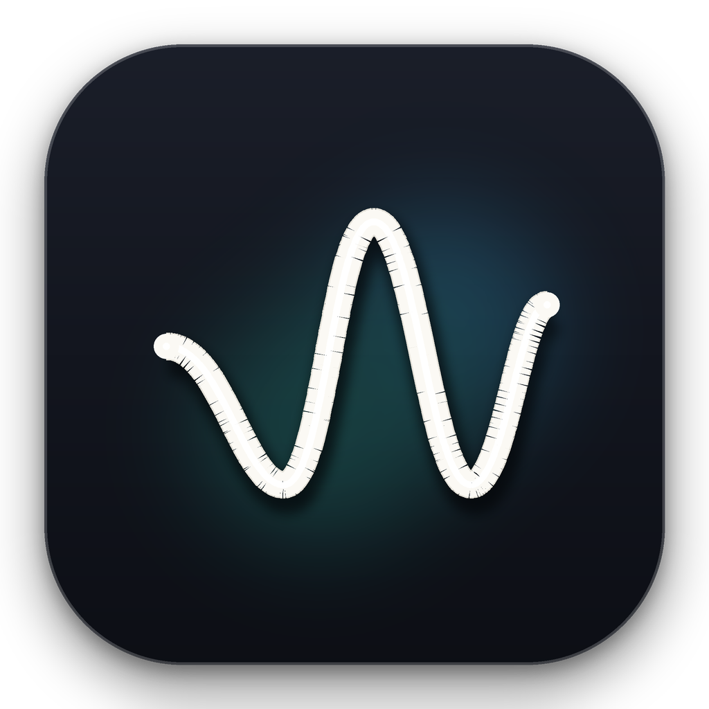
</p>

<h1 align="center">Wattly</h1>

<p align="center">
  <em>Pure Swift Apple Silicon telemetry & smart thermal control designed exclusively for macOS.</em>
</p>

<p align="center">
  <a href="#installation"><strong>Installation Guide</strong></a> &nbsp;&bull;&nbsp;
  <a href="https://github.com/jjundev/project_wattly/releases"><strong>Download Releases (.dmg / .zip)</strong></a>
</p>

---

## Overview

**Wattly** is a native, ultra-lightweight menu bar system monitor and intelligent fan controller engineered from the ground up for Apple Silicon Macs. Written entirely in **Swift 6** with strict concurrency and rendered using **SwiftUI**, Wattly delivers milliwatt-precision SoC telemetry, per-cluster CPU/GPU performance breakdown, kernel memory pressure tracking, real-time battery analytics, and custom fan curves—all while consuming near-zero CPU cycles and battery power.

<p align="center">
  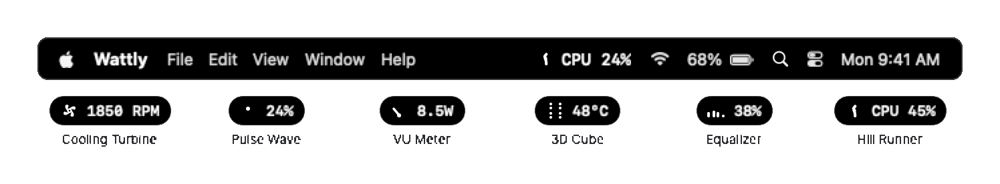
</p>

### Key Highlights

- **Pure Swift 6 & Native SwiftUI**: Zero third-party runtime dependencies, zero Electron overhead, and no Metal GPU wakeups.
- **Zero-Privilege Telemetry**: Full read-only telemetry operates entirely within standard user-space via `IOReport`, AppleSMC read keys, Mach kernel APIs, and IOHID. No root privileges or daemons required for monitoring.
- **Milliwatt SoC Energy Breakdown**: Real-time per-engine power consumption (CPU, GPU, and Apple Neural Engine / ANE) with 4-second exponential moving average (EMA) smoothing.
- **Micro-Architecture CPU & GPU Metrics**: Super, Performance (P), and Efficiency (E) core cluster utilization, active clock frequencies (GHz), GPU 3D Renderer and Tiler utilization, and unified Metal VRAM allocation.
- **True System Net Discharge**: Accurate battery draw computed from SMC voltage and amperage telemetry with two's complement sign handling.
- **Smart Fan Curve Engine**: Fully customizable multi-point temperature-to-RPM spline curves with zero-RPM hysteresis hold zones, watchdog failsafes, and isolated daemon execution.
- **Adaptive Polling Engine**: Intelligently throttles sampling frequency (1–2s when popover is open, 2–5s when closed in background) to guarantee negligible self-power consumption (<0.05W).

---

## Popover Presentation Modes

Wattly adapts to your workflow with three carefully designed popover presentation layouts:

| Mode A: Stacked Cards | Mode B: Compact Grid | Mode C: Hero + List |
| :---: | :---: | :---: |
| 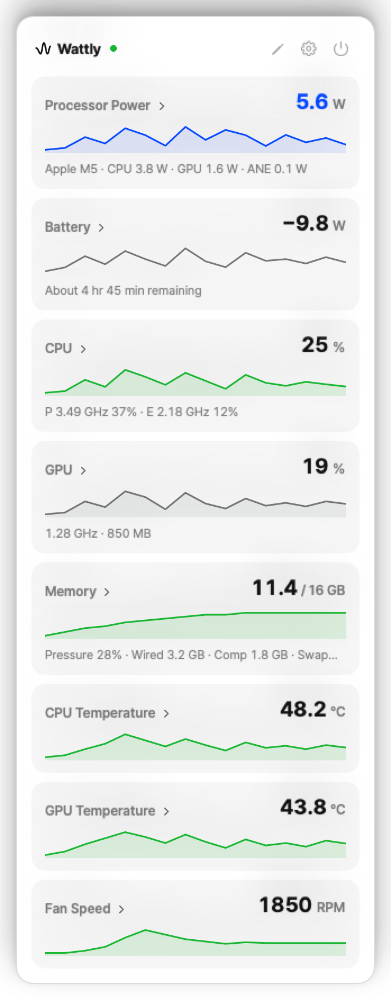 | 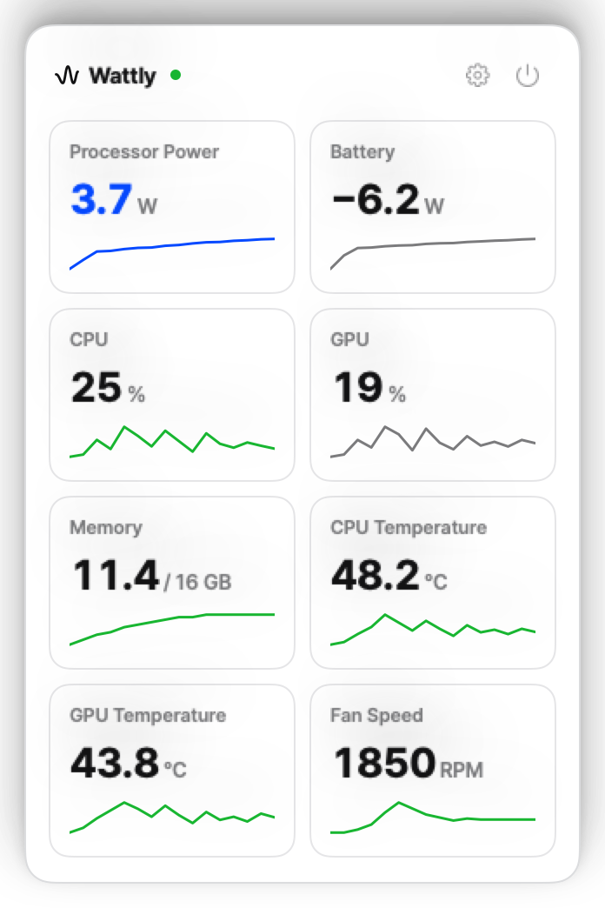 | 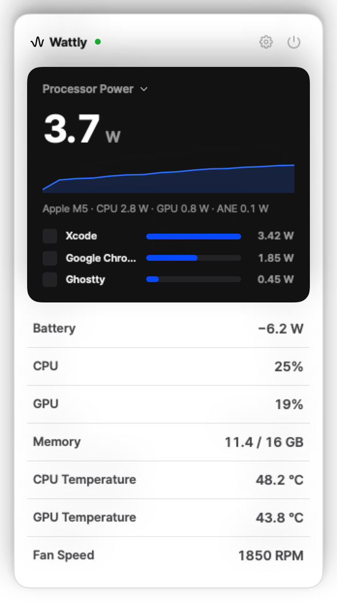 |
| **Deep-Dive Overview**<br/>Expandable cards with 60-second telemetry sparklines and process rankings. | **High-Density Dashboard**<br/>2-column compact metric tiles for immediate at-a-glance status. | **Focus Telemetry**<br/>Prominent hero metric (e.g. SoC Total Watts) with detailed sub-metrics. |

---

## Hardware Deep-Dive Telemetry

Each telemetry domain in Wattly expands into a dedicated diagnostic card with real-time metrics, historical trends, and process attribution.

### 1. Processor Power Breakdown
<p align="center">
  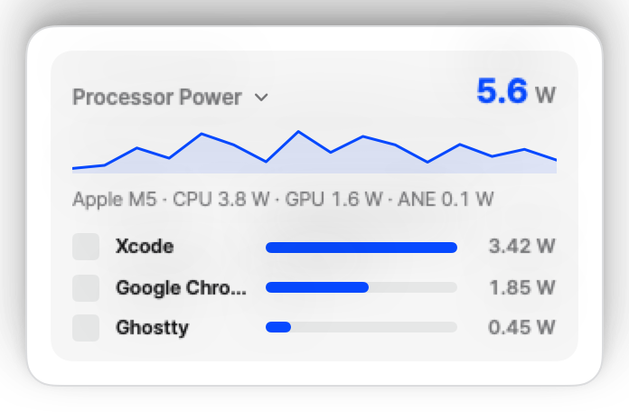
</p>

- **Real-Time Engine Watts**: Continuous power tracking for CPU, GPU, and Apple Neural Engine (ANE) via private `IOReport` Energy Model subscriptions.
- **Top Power Consumers**: Real-time process ranking identifying applications causing transient power spikes.
- **EMA Filtered Trends**: 4-second time-constant exponential moving average filters eliminate reading jitter while preserving response dynamics.

### 2. CPU Cluster Architecture & Frequency
<p align="center">
  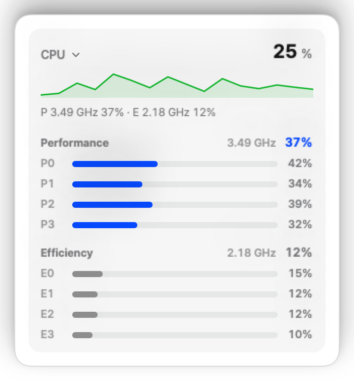
</p>

- **Topology-Aware Core Gauges**: Dynamic runtime core mapping using `sysctl` (`hw.perflevel`) supporting Super, Performance (P), and Efficiency (E) clusters.
- **Per-Core Utilization**: High-resolution tick snapshot diffs via `host_processor_info(PROCESSOR_CPU_LOAD_INFO)`.
- **Live Frequency Scaling**: Instantaneous active clock speeds (GHz) per cluster.

### 3. GPU Pipeline & Unified VRAM
<p align="center">
  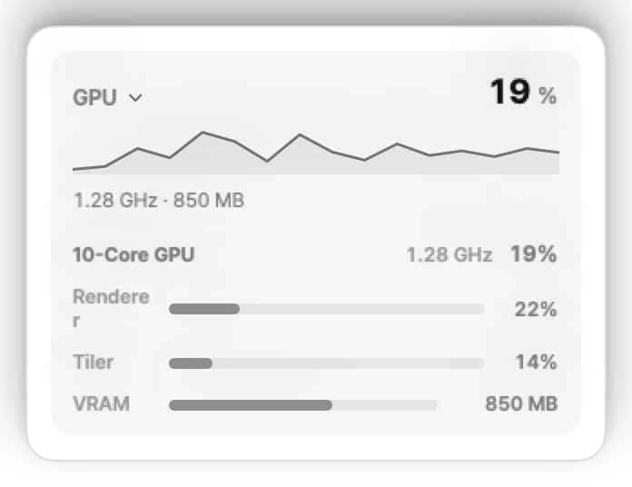
</p>

- **3D Renderer & Tiler Utilization**: Dual-pipeline activity tracking reflecting true graphics and compute workloads.
- **GPU Core Frequency**: Real-time core clock monitoring.
- **Unified VRAM Allocation**: Dedicated Metal memory tracking displaying dynamic in-use memory versus total reserved VRAM heap.

### 4. Unified Memory & Pressure
<p align="center">
  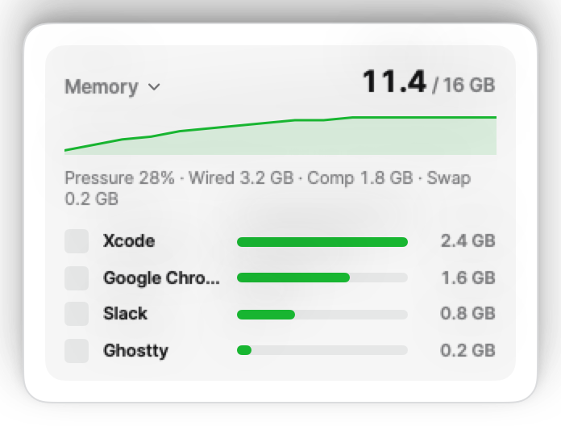
</p>

- **Kernel Virtual Memory Breakdown**: Precise distribution of Active, Wired, Compressed, and Swap pages via `host_statistics64(HOST_VM_INFO64)`.
- **Memory Pressure Index**: Color-coded system memory pressure gauge reflecting OS paging headroom.
- **Top Footprint Applications**: Instant process attribution sorting memory consumption by physical footprint.

### 5. Battery & Power Telemetry
<p align="center">
  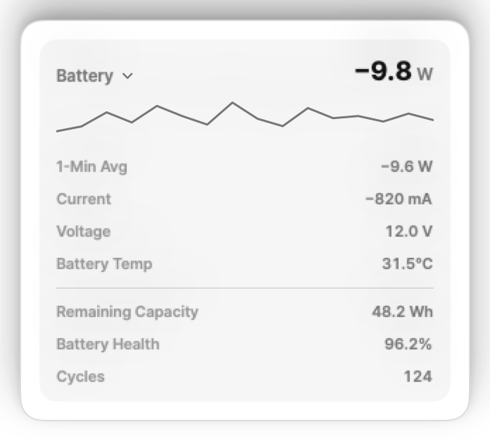
</p>

- **System Net Discharge (W)**: Derived from AppleSMC `B0AP` / `B0AV` × `B0AC` registers with signed 64-bit two's complement decoding—capturing total system draw including display backlight, SSD, Wi-Fi, and audio subsystem.
- **1-Minute EMA Rate**: Smoothed discharge estimation for predictable runtime calculations.
- **Health & Capacity Telemetry**: Real-time milliampere-hour (mAh) and Watt-hour (Wh) capacity, battery wear percentage, cycle counts, charging state, and bus voltage/amperage.

### 6. Cluster Thermals & Hotspots
<p align="center">
  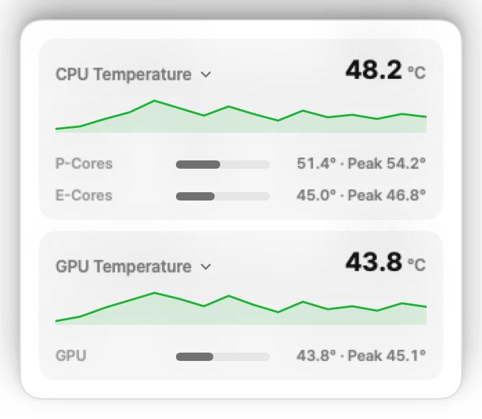
</p>

- **Multi-Sensor Thermal Aggregation**: Direct hardware readings across P-Core clusters, E-Core clusters, and GPU silicon.
- **Peak Hotspot Detection**: Automatic maximum sensor selection identifying silicon thermal bottlenecks in real time.
- **Thermal Headroom**: Proactive monitoring preventing unexpected OS thermal throttling during sustained compilation or render workloads.

---

## Smart Fan Curve Editor & Thermal Management

Wattly features a precision multi-point fan curve engine designed to keep your Apple Silicon Mac quiet during light workflows and cool under sustained heavy loads.

<p align="center">
  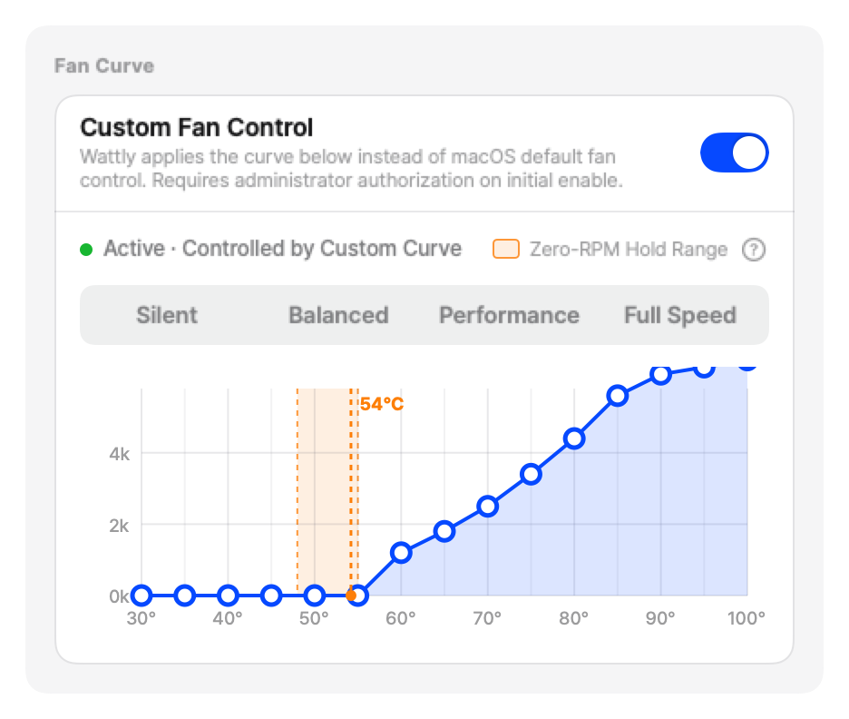
</p>

### Key Capabilities

- **Interactive Control Points**: Drag or configure custom temperature-to-RPM thresholds across the full operating range.
- **Zero-RPM Hysteresis Zone**: Built-in 48°C–55°C hold band prevents annoying fan start/stop oscillations during intermittent tasks.
- **Optimized Tuning Presets**:
  - **Quiet**: Maintains zero or minimum RPM up to 65°C for silent acoustic operation.
  - **Balanced**: Standard linear curve maintaining optimal balance between acoustic comfort and component longevity.
  - **Performance**: Aggressive ramp-up keeping thermals below 75°C during intense compilation or gaming.
  - **Manual Override**: Direct RPM lock for specific testing or thermal profiling.
- **Hardware-Level Failsafes**:
  - Automatic override to 100% maximum RPM if silicon temperatures exceed 100°C.
  - Automatic return to macOS kernel automatic fan control upon application exit, system sleep, sensor read error, or 15-second heartbeat watchdog timeout.

---

## Architecture & Zero-Privilege Security

Wattly implements a strict separation of concerns to guarantee maximum security, stability, and system performance.

<p align="center">
  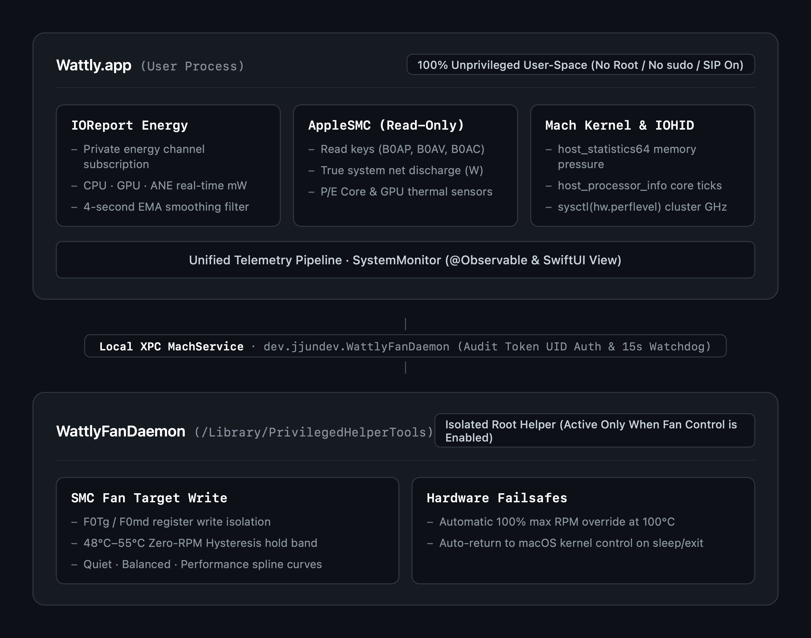
</p>

1. **Unprivileged Telemetry Pipeline (Reader)**:
   - Operates entirely within standard user permissions.
   - Reads energy counters via `libIOReport.dylib`, sensor temperatures via SMC read keys, memory stats via `host_statistics64`, and core ticks via `host_processor_info`.
   - Requires zero helper tools, no `sudo`, and no system integrity compromises.

2. **Isolated Fan Helper Daemon (`WattlyFanDaemon`)**:
   - Optional, dedicated helper installed via `SMJobBless` / `launchd` only when fan control is explicitly enabled.
   - Isolated exclusively to writing target RPM registers (`F0Tg`, `F0md`).
   - Communication is secured via local XPC with audit-token UID verification and automatic heartbeat watchdog release.

---

## Apple Silicon Compatibility Matrix

Wattly is built specifically for the Apple Silicon architecture, supporting all generations and tiers:

| Generation | Base Chip | Pro Chip | Max Chip | Ultra Chip | macOS Compatibility |
| :--- | :---: | :---: | :---: | :---: | :---: |
| **Apple M1 Series** | M1 | M1 Pro | M1 Max | M1 Ultra | macOS 14.0+ (Sonoma) / 15.0+ (Sequoia) |
| **Apple M2 Series** | M2 | M2 Pro | M2 Max | M2 Ultra | macOS 14.0+ (Sonoma) / 15.0+ (Sequoia) |
| **Apple M3 Series** | M3 | M3 Pro | M3 Max | M3 Ultra | macOS 14.0+ (Sonoma) / 15.0+ (Sequoia) |
| **Apple M4 Series** | M4 | M4 Pro | M4 Max | M4 Ultra | macOS 14.0+ (Sonoma) / 15.0+ (Sequoia) |

*Full feature support across all models: SoC Watts, CPU P/E Clusters, GPU Tiler/Renderer, Unified VRAM, System Discharge, Cluster Thermals, and Smart Fan Control.*

---

## Customization & Preferences

### Menu Bar Appearance
Tailor the menu bar item to match your aesthetic and information density requirements:

<p align="center">
  
</p>

<p align="center">
  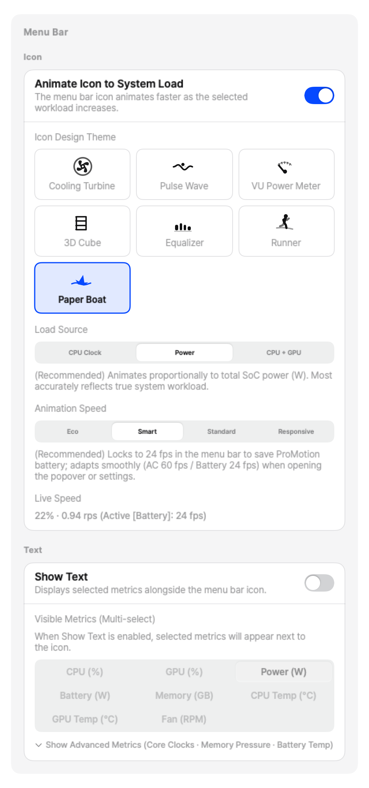
</p>

- **Display Formats**: Choose between Icon Only, Live Wattage (W), CPU Percentage (%), Peak Thermals (°C), or custom multi-metric combinations.
- **Visual Styles**: Modern typography, compact pill badges, and kinetic pulse indicators.

### Dynamic Alert Thresholds
<p align="center">
  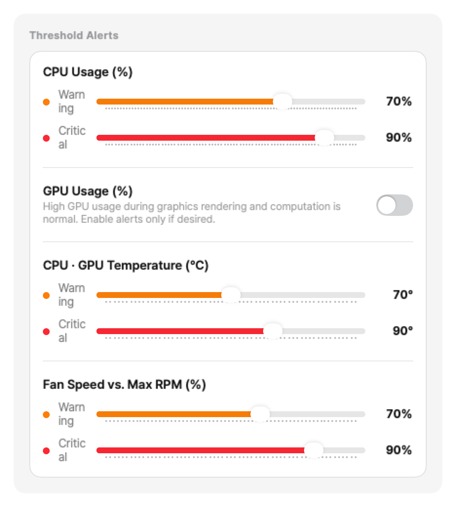
</p>

- Configure custom warning and critical thresholds for SoC Power (W), CPU Load (%), Memory Pressure, and Hotspot Temperatures (°C).
- Visual warning highlights in the menu bar and popover when operating near thermal or power limits.

### Display & Behavior
<p align="center">
  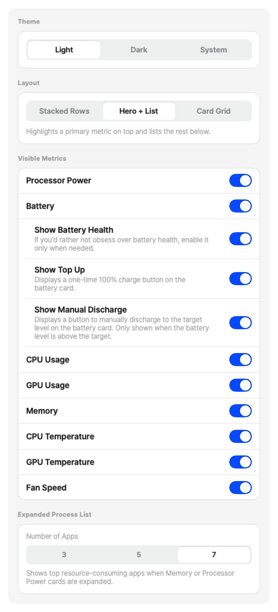
</p>

- **Adaptive Polling Rates**: Configurable active (1–2s) and background (2–5s) refresh intervals.
- **Launch at Login**: Seamless auto-start configuration via `SMAppService`.
- **Unit Preferences**: Toggle between Celsius (°C) and Fahrenheit (°F).

---

## Installation

### Option 1: Homebrew Cask (Recommended)

```bash
brew install --cask wattly
```

### Option 2: Direct Download

Download the latest signed `.dmg` installer directly from the [GitHub Releases](https://github.com/jjundev/project_wattly/releases) page. Drag `Wattly.app` to your `Applications` folder and launch.

### Option 3: Build from Source

Requirements: macOS 14.0+, Xcode 16.0+, and [XcodeGen](https://github.com/yonaskolb/XcodeGen).

```bash
# 1. Clone the repository
git clone https://github.com/jjundev/project_wattly.git
cd project_wattly

# 2. Install XcodeGen if not already installed
brew install xcodegen

# 3. Generate Xcode project files
xcodegen generate

# 4. Build Release binary
xcodebuild -project Wattly.xcodeproj -scheme Wattly -configuration Release build

# 5. Locate built app bundle
open build/Release
```

---

## License

Wattly is released under the **MIT License**. See [LICENSE](LICENSE) for details.

---

<p align="center">
  Crafted with precision for macOS and Apple Silicon.
</p>
