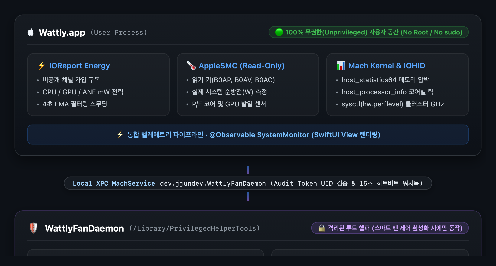

**한국어** | [English](README.en.md)

<p align="center">
  
</p>

<h1 align="center">Wattly</h1>

<p align="center">
  <em>Apple Silicon Mac을 위해 순수 Swift로 설계된 초경량 시스템 텔레메트리 & 스마트 팬 제어 유틸리티</em>
</p>

<p align="center">
  <a href="#설치-방법"><strong>설치 가이드</strong></a> &nbsp;&bull;&nbsp;
  <a href="https://github.com/jjundev/project_wattly/releases"><strong>최신 릴리즈 다운로드 (.dmg / .zip)</strong></a>
</p>

---

## 개요

**Wattly**는 Apple Silicon Mac을 위해 처음부터 완전히 새롭게 설계된 네이티브 메뉴바 시스템 모니터 및 지능형 팬 컨트롤러입니다. 엄격한 동시성(Strict Concurrency)을 갖춘 **Swift 6**와 **SwiftUI**로 작성되어, CPU 점유율과 배터리 소모를 0에 가깝게 유지하면서도 밀리와트(mW) 단위의 SoC 전력 측정, 클러스터별 CPU/GPU 성능 분석, 커널 메모리 압박 감시, 실시간 배터리 정밀 분석, 맞춤형 스마트 팬 커브 제어를 지원합니다.

<p align="center">
  
</p>

### 핵심 특징

- **순수 Swift 6 & 네이티브 SwiftUI**: 서드파티 런타임 의존성 0개, Electron 오버헤드 전무, 불필요한 Metal GPU 웨이크업 완전 배제.
- **무권한(Zero-Privilege) 텔레메트리**: 읽기 전용 텔레메트리는 `IOReport`, AppleSMC 읽기 키, Mach 커널 API, IOHID를 통해 100% 표준 사용자 공간(User-space)에서 동작합니다. 일반 모니터링 시 root 권한이나 백그라운드 데몬이 일체 불필요합니다.
- **밀리와트(mW) 단위 SoC 전력 분석**: 비공개 `IOReport` Energy Model 구독을 통한 CPU, GPU, Apple Neural Engine (ANE) 실시간 전력 추적 및 4초 EMA(지수 이동 평균) 필터링.
- **마이크로아키텍처 CPU & GPU 세부 지표**: Super, Performance(P), Efficiency(E) 코어 클러스터 사용률, 실시간 클럭 주파수(GHz), GPU 3D 렌더러 및 타일러 점유율, Metal 통합 VRAM 할당량.
- **진정한 시스템 순방전(Net Discharge) 측정**: SMC 전압 및 전류 텔레메트리로부터 2의 보수 부호 디코딩을 거쳐 디스플레이, SSD, Wi-Fi, 오디오를 포함한 실제 시스템 전체 소모 전력 측정.
- **스마트 팬 커브 엔진**: 48°C~55°C 상태 유지 구간(Zero-RPM Hysteresis), 하드웨어 안전장치(Watchdog Failsafe), 격리된 헬퍼 데몬 기반의 완벽한 멀티포인트 온도-RPM 커브 제어.
- **적응형 폴링(Adaptive Polling) 엔진**: 팝오버 개방 여부에 따라 폴링 주기 자동 전환(팝오버 열림: 1~2초, 닫힘/백그라운드: 2~5초)을 통해 자체 전력 소비 0.05W 미만 유지.

---

## 팝오버 3대 레이아웃 모드

Wattly는 사용자의 작업 환경과 워크플로우에 맞춰 세 가지 정밀한 팝오버 레이아웃 모드를 제공합니다:

| 모드 A: 스택형 카드 | 모드 B: 컴팩트 그리드 | 모드 C: 히어로 + 리스트 |
| :---: | :---: | :---: |
|  |  |  |
| **정밀 분해 오버뷰**<br/>60초 텔레메트리 스파크라인 및 프로세스 점유 순위가 포함된 확장형 카드. | **고밀도 대시보드**<br/>한눈에 모든 주요 지표를 파악할 수 있는 2열 컴팩트 타일 레이아웃. | **집중 텔레메트리**<br/>주요 핵심 지표(예: SoC 총 전력)를 상단에 강조하고 하단에 상세 지표 배치. |

---

## 하드웨어 정밀 분해 텔레메트리

Wattly의 각 텔레메트리 도메인은 실시간 지표, 기록 추세, 프로세스 귀속 정보를 담은 전용 진단 카드로 확장됩니다.

### 1. 프로세서 전력 SoC 분해
<p align="center">
  
</p>

- **실시간 엔진 전력(W)**: 비공개 `IOReport` Energy Model 채널을 통해 CPU, GPU, Apple Neural Engine (ANE)의 전력 소비를 밀리와트 단위로 연속 추적.
- **상위 전력 소모 프로세스**: 순간적인 전력 스파이크를 유발하는 백그라운드/포그라운드 애플리케이션 실시간 랭킹.
- **EMA 필터링 추세**: 4초 시상수 지수 이동 평균(EMA) 필터를 적용하여 센서 노이즈를 제거하면서도 즉각적인 반응성 유지.

### 2. CPU 클러스터 아키텍처 및 주파수
<p align="center">
  
</p>

- **토폴로지 인식 코어 게이지**: `sysctl` (`hw.perflevel`) 런타임 쿼리를 통해 Super, Performance(P), Efficiency(E) 클러스터를 정확히 인식하고 코어별 게이지 렌더링.
- **코어별 사용률**: `host_processor_info(PROCESSOR_CPU_LOAD_INFO)` 틱 스냅샷 차분을 통한 고정밀 코어별 점유율 산출.
- **실시간 클럭 주파수 스케일링**: 클러스터별 실시간 동작 클럭(GHz) 모니터링.

### 3. GPU 파이프라인 및 통합 VRAM
<p align="center">
  
</p>

- **3D 렌더러 & 타일러 사용률**: 실제 그래픽 렌더링 및 컴퓨트 연산 부하를 반영하는 듀얼 파이프라인 점유율 추적.
- **GPU 코어 클럭**: 실시간 GPU 코어 주파수 모니터링.
- **통합 Metal VRAM 할당량**: 동적 사용 메모리(In-Use)와 전체 예약 VRAM 힙(Allocated Heap)을 분리하여 정밀 추적.

### 4. 통합 메모리 및 메모리 압박
<p align="center">
  
</p>

- **커널 가상 메모리 분해**: `host_statistics64(HOST_VM_INFO64)`를 통해 Active, Wired, Compressed, Swap 페이지를 정확하게 분류.
- **메모리 압박 인덱스**: macOS 페이징 여유도를 직관적인 컬러 게이지로 표시.
- **물리 풋프린트 기준 상위 앱**: 단순 가상 메모리가 아닌 실제 물리 메모리 점유량(Physical Footprint)을 기준으로 정렬.

### 5. 배터리 & 전원 텔레메트리
<p align="center">
  
</p>

- **시스템 순방전(Net Discharge, W)**: AppleSMC `B0AP` / `B0AV` × `B0AC` 레지스터로부터 64비트 2의 보수 부호 디코딩을 수행하여, SoC뿐만 아니라 디스플레이 백라이트, SSD, Wi-Fi, 오디오 앰프 등 시스템 전체의 실제 방전/충전 전력 측정.
- **1분 EMA 방전율**: 급격한 변동을 완화하여 안정적인 배터리 잔여 시간 계산.
- **건강도 및 용량 텔레메트리**: 실시간 잔여 용량(mAh/Wh), 배터리 최대 성능치(Health %), 사이클 수, 충전 상태 및 버스 전압/전류 표시.

### 6. 클러스터 발열 및 핫스팟
<p align="center">
  
</p>

- **다중 센서 발열 집계**: P-Core 클러스터, E-Core 클러스터, GPU 실리콘의 하드웨어 센서 직접 판독.
- **최고 핫스팟 탐지**: 실시간으로 가장 온도가 높은 센서를 감지하여 써멀 스로틀링 위험 구역 식별.
- **써멀 헤드룸 감시**: 대규모 빌드나 렌더링 작업 시 예기치 않은 스로틀링 발생 전 여유 온도 사전 파악.

---

## 스마트 팬 커브 에디터 & 발열 제어

Wattly는 가벼운 작업 시에는 조용함을 유지하고 장시간의 고부하 작업 시에는 온도를 낮게 유지하도록 정밀한 멀티포인트 팬 커브 엔진을 제공합니다.

<p align="center">
  
</p>

### 핵심 기능

- **인터랙티브 제어점**: 전체 동작 온도 범위에 걸쳐 마우스 드래그 또는 수치 입력을 통한 맞춤형 온도-RPM 임계값 구성.
- **상태 유지 구간 (Zero-RPM Hysteresis Zone)**: 48°C~55°C 히스테리시스 밴드를 내장하여 가벼운 작업 시 팬이 켜졌다 꺼지기를 반복하는 소음 방지.
- **최적화된 튜닝 프리셋**:
  - **조용함 (Quiet)**: 최대 65°C까지 팬을 정지(0 RPM) 또는 최저 RPM으로 유지하여 무소음 환경 보장.
  - **밸런스 (Balanced)**: 소음과 부품 수명 사이의 최적 균형을 유지하는 표준 리니어 커브.
  - **고성능 (Performance)**: 고부하 컴파일이나 게이밍 환경에서 온도를 75°C 이하로 유지하는 공격적인 쿨링 커브.
  - **수동 제어 (Manual Override)**: 특정 벤치마크나 발열 프로파일링을 위한 고정 RPM 수동 설정.
- **하드웨어 레벨 안전장치**:
  - 실리콘 온도가 100°C를 초과할 경우 즉시 팬 속도를 100% 최대 RPM으로 강제 승격.
  - 앱 종료, 시스템 잠자기, 센서 읽기 오류, 또는 15초 하트비트 워치독 타임아웃 발생 시 macOS 커널 기본 자동 팬 제어로 안전하게 즉시 복귀.

---

## 아키텍처 & 무권한(Zero-Privilege) 보안 모델

Wattly는 최상의 보안, 시스템 안정성 및 성능을 보장하기 위해 관심사 분리(Separation of Concerns) 원칙을 엄격하게 구현합니다.

<p align="center">
  
</p>

1. **무권한 텔레메트리 파이프라인 (Reader)**:
   - 표준 일반 사용자 권한으로 100% 동작합니다.
   - `libIOReport.dylib`를 통한 에너지 카운터, SMC 읽기 키를 통한 센서 온도, `host_statistics64`를 통한 가상 메모리, `host_processor_info`를 통한 CPU 틱을 읽습니다.
   - 별도의 헬퍼 도구 설치, `sudo` 권한, 시스템 무결성 보호(SIP) 비활성화가 일체 불필요합니다.

2. **격리된 팬 도우미 데몬 (`WattlyFanDaemon`)**:
   - 팬 제어 기능을 명시적으로 활성화할 때만 `SMJobBless` / `launchd`를 통해 설치되는 전용 헬퍼입니다.
   - 목표 팬 RPM 레지스터(`F0Tg`, `F0md`) 쓰기 작업만 수행하도록 엄격하게 격리되어 있습니다.
   - 통신은 로컬 XPC로 보호되며, Audit Token UID 검증 및 15초 하트비트 워치독을 통해 안전하게 동작합니다.

---

## Apple Silicon 호환성 표

Wattly는 Apple Silicon 아키텍처 전용으로 제작되었으며, 모든 세대 및 티어를 지원합니다:

| 세대 | 기본 칩 (Base) | Pro 칩 | Max 칩 | Ultra 칩 | macOS 호환성 |
| :--- | :---: | :---: | :---: | :---: | :---: |
| **Apple M1 시리즈** | M1 | M1 Pro | M1 Max | M1 Ultra | macOS 14.0+ (Sonoma) / 15.0+ (Sequoia) |
| **Apple M2 시리즈** | M2 | M2 Pro | M2 Max | M2 Ultra | macOS 14.0+ (Sonoma) / 15.0+ (Sequoia) |
| **Apple M3 시리즈** | M3 | M3 Pro | M3 Max | M3 Ultra | macOS 14.0+ (Sonoma) / 15.0+ (Sequoia) |
| **Apple M4 시리즈** | M4 | M4 Pro | M4 Max | M4 Ultra | macOS 14.0+ (Sonoma) / 15.0+ (Sequoia) |

*모든 모델에서 전 기능 지원: SoC 전력(W), CPU P/E 클러스터, GPU 타일러/렌더러, 통합 VRAM, 시스템 순방전, 클러스터 발열 및 스마트 팬 제어.*

---

## 설정 및 개인화 가이드

### 메뉴바 스타일 설정
원하는 시각적 스타일과 정보 밀도에 맞춰 메뉴바 표시 항목을 자유롭게 커스터마이징할 수 있습니다:

<p align="center">
  
</p>

<p align="center">
  
</p>

- **표시 형식**: 아이콘 전용, 실시간 전력(W), CPU 사용률(%), 최고 온도(°C), 또는 복합 지표 조합 중 선택 가능.
- **시각 스타일**: 모던 타이포그래피, 컴팩트 알약 뱃지, 키네틱 펄스 인디케이터.

### 동적 알림 임계값 설정
<p align="center">
  
</p>

- SoC 전력(W), CPU 부하(%), 메모리 압박, 핫스팟 온도(°C)에 대한 맞춤형 경고 및 위험 임계값 설정.
- 발열이나 전력 한계치에 근접할 때 메뉴바 아이콘 및 팝오버 내 시각적 경고 하이라이트 제공.

### 표시 및 동작 설정
<p align="center">
  
</p>

- **적응형 폴링 주기**: 활성 상태(1~2초) 및 백그라운드 상태(2~5초) 갱신 주기 설정.
- **로그인 시 자동 시작**: `SMAppService`를 통한 깔끔한 시스템 시작 시 자동 실행 구성.
- **온도 단위 설정**: 섭씨(°C) 및 화씨(°F) 전환 지원.

---

## 설치 방법

### 옵션 1: Homebrew Cask (권장)

```bash
brew install --cask wattly
```

### 옵션 2: 직접 다운로드

[GitHub Releases](https://github.com/jjundev/project_wattly/releases) 페이지에서 서명된 최신 `.dmg` 설치 파일을 직접 다운로드할 수 있습니다. `Wattly.app`을 `Applications` (응용 프로그램) 폴더로 드래그한 후 실행하세요.

### 옵션 3: 소스 코드 빌드

요구 사항: macOS 14.0+, Xcode 16.0+, [XcodeGen](https://github.com/yonaskolb/XcodeGen).

```bash
# 1. 저장소 클론
git clone https://github.com/jjundev/project_wattly.git
cd project_wattly

# 2. XcodeGen 설치 (미설치 시)
brew install xcodegen

# 3. Xcode 프로젝트 파일 생성
xcodegen generate

# 4. Release 바이너리 빌드
xcodebuild -project Wattly.xcodeproj -scheme Wattly -configuration Release build

# 5. 빌드된 앱 번들 확인
open build/Release
```

---

## 라이선스

Wattly는 **MIT License**에 따라 배포됩니다. 자세한 내용은 [LICENSE](LICENSE)를 참조하세요.

---

<p align="center">
  Apple Silicon과 macOS를 위해 정밀하게 설계되었습니다.
</p>
