**한국어** | [English](README.en.md)

<p align="center">
  
</p>

<h1 align="center">Wattly</h1>

<p align="center">
  <em>Apple Silicon Mac을 위해 순수 Swift로 설계된 초경량 시스템 텔레메트리, 배터리 수명 관리 & 지능형 팬 컨트롤러</em>
</p>

<p align="center">
  <a href="#설치-방법"><strong>설치 가이드</strong></a> &nbsp;&bull;&nbsp;
  <a href="#핵심-특징"><strong>주요 특징</strong></a> &nbsp;&bull;&nbsp;
  <a href="#하드웨어-정밀-분해-텔레메트리"><strong>텔레메트리</strong></a> &nbsp;&bull;&nbsp;
  <a href="#배터리-정밀-제어--수명-보호"><strong>배터리 수명 관리</strong></a> &nbsp;&bull;&nbsp;
  <a href="#스마트-팬-커브-에디터--발열-제어"><strong>스마트 팬 제어</strong></a> &nbsp;&bull;&nbsp;
  <a href="#apple-shortcuts-단축어-연동-및-자동화"><strong>단축어 자동화</strong></a> &nbsp;&bull;&nbsp;
  <a href="https://github.com/jjundev/project_wattly/releases"><strong>최신 릴리즈 다운로드</strong></a>
</p>

---

## 개요

**Wattly**는 Apple Silicon Mac(M1, M2, M3, M4, M5 전 세대)을 위해 처음부터 완전히 새롭게 설계된 네이티브 메뉴바 시스템 모니터, 배터리 수명 관리 도구 및 지능형 팬 컨트롤러입니다. 엄격한 동시성(Strict Concurrency)을 갖춘 **Swift 6**와 **SwiftUI**로 작성되어, CPU 점유율과 배터리 소모를 0에 가깝게 유지하면서도 밀리와트(mW) 단위의 SoC 전력 측정, 클러스터별 CPU/GPU 성능 분석, 커널 메모리 압박 감시, 실시간 배터리 정밀 분석 및 충전 제어, 맞춤형 스마트 팬 커브 제어, Apple Shortcuts 단축어 자동화를 지원합니다.

<p align="center">
  
</p>

### 핵심 특징

- **순수 Swift 6 & 네이티브 SwiftUI**: 서드파티 런타임 의존성 0개, Electron 오버헤드 전무, 불필요한 Metal GPU 웨이크업 완전 배제.
- **무권한(Zero-Privilege) 텔레메트리**: 읽기 전용 텔레메트리는 `IOReport`, AppleSMC 읽기 키, Mach 커널 API, IOHID를 통해 100% 표준 사용자 공간(User-space)에서 동작합니다. 일반 모니터링 시 root 권한이나 백그라운드 데몬이 일체 불필요합니다.
- **배터리 수명 관리 슈트 (Battery Health Suite)**: 80%~95% 충전 상한 제한(Charge Limit), Sailing 모드(자연 방전 밴드), 35°C 발열 보호, 일회성 완충(One-Time Top-Up), 자동 및 수동 강제 방전(Discharge), 요일/시간대별 충전 스케줄링 지원.
- **Apple Shortcuts (단축어) & App Intents 연동**: Siri 및 단축어 앱을 통해 배터리 상태 조회, 한도 설정, Sailing 및 완충 제어를 완벽히 자동화.
- **App-Identity 지능형 프로세스 그룹화**: `AppIdentity` 엔진을 통해 번들 ID(`CFBundleIdentifier`) 기반 프로세스 통합 집계 및 실제 앱 명칭(`CFBundleDisplayName`) 추출.
- **밀리와트(mW) 단위 SoC 전력 분석**: 비공개 `IOReport` Energy Model 구독을 통한 CPU, GPU, Apple Neural Engine (ANE) 실시간 전력 추적 및 4초 EMA(지수 이동 평균) 필터링.
- **마이크로아키텍처 CPU & GPU 세부 지표**: Super, Performance(P), Efficiency(E) 코어 클러스터 사용률, 실시간 클럭 주파수(GHz), GPU 3D 렌더러 및 타일러 점유율, Metal 통합 VRAM 할당량.
- **진정한 시스템 순방전(Net Discharge) 측정**: SMC 전압 및 전류 텔레메트리로부터 2의 보수 부호 디코딩을 거쳐 디스플레이, SSD, Wi-Fi, 오디오를 포함한 실제 시스템 전체 소모 전력 측정.
- **스마트 팬 커브 & 하드웨어 경고**: 48°C~55°C 상태 유지 구간(Zero-RPM Hysteresis), 최대 RPM 대비 상대적 부하율(70%/90%) 경고, 하드웨어 안전장치(Watchdog Failsafe), 검증된 안전 릴리즈(Verified Release) 복구.
- **30개 이상 글로벌 다국어 지원 & 개발자 피드백**: 한국어, 영어, 일본어, 중국어 등 30개 언어 지원 및 Gmail 웹메일 진단 데이터 원클릭 전송.
- **적응형 폴링(Adaptive Polling) 엔진**: 팝오버 개방 여부에 따라 폴링 주기 자동 전환(팝오버 열림: 1~2초, 닫힘/백그라운드: 2~5초)을 통해 자체 전력 소비 0.05W 미만 유지.

---

## 팝오버 3대 레이아웃 모드

Wattly는 사용자의 작업 환경과 워크플로우에 맞춰 세 가지 정밀한 팝오버 레이아웃 모드를 제공합니다:

| 모드 A: 스택형 카드 | 모드 B: 컴팩트 그리드 | 모드 C: 히어로 + 리스트 |
| :---: | :---: | :---: |
| 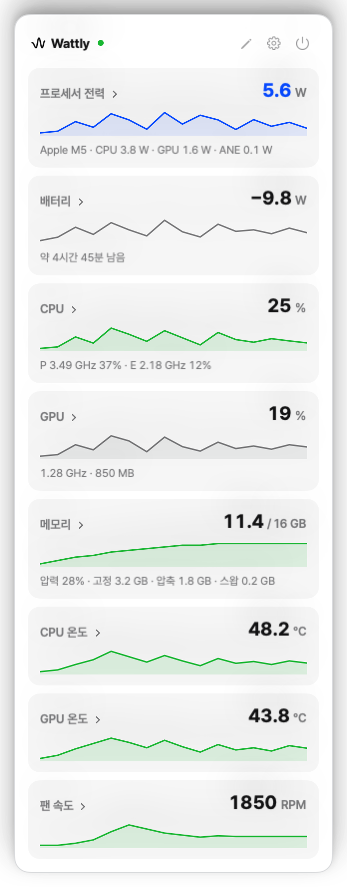 | 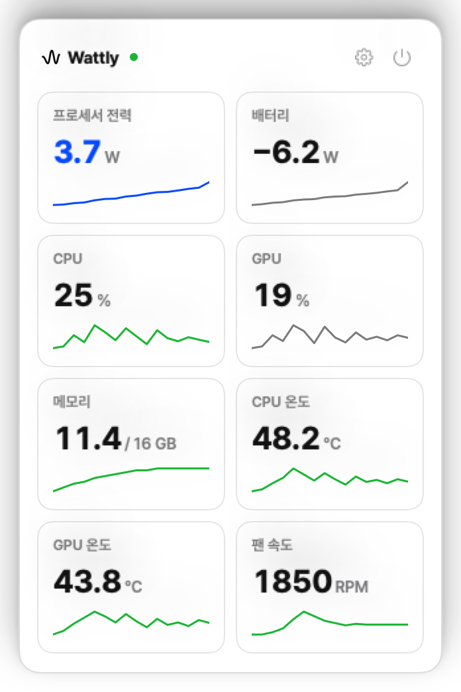 | 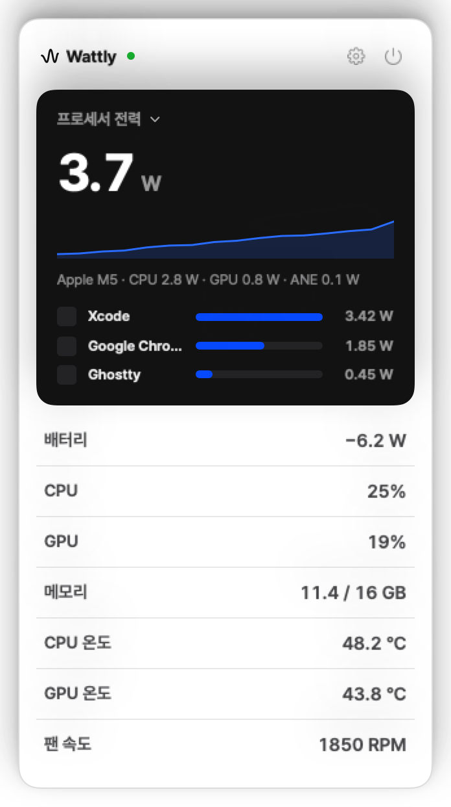 |
| **정밀 분해 오버뷰**<br/>60초 텔레메트리 스파크라인 및 프로세스 점유 순위가 포함된 확장형 카드. | **고밀도 대시보드**<br/>한눈에 모든 주요 지표를 파악할 수 있는 2열 컴팩트 타일 레이아웃. | **집중 텔레메트리**<br/>주요 핵심 지표(예: SoC 총 전력)를 상단에 강조하고 하단에 상세 지표 배치. |

---

## 하드웨어 정밀 분해 텔레메트리

Wattly의 각 텔레메트리 도메인은 실시간 지표, 기록 추세, 프로세스 귀속 정보를 담은 전용 진단 카드로 확장됩니다.

### 1. 프로세서 전력 SoC 분해
<p align="center">
  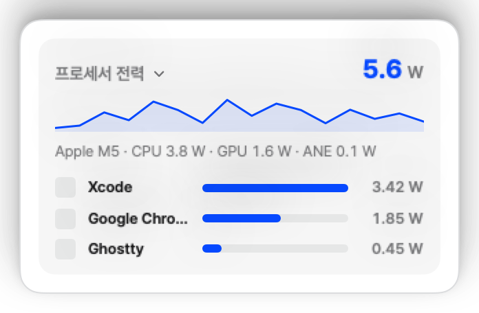
</p>

- **실시간 엔진 전력(W)**: 비공개 `IOReport` Energy Model 채널을 통해 CPU, GPU, Apple Neural Engine (ANE)의 전력 소비를 밀리와트 단위로 연속 추적.
- **상위 전력 소모 프로세스**: `BundleMetadataCache` 메모이제이션을 통해 불필요한 디스크 I/O 없이 백그라운드/포그라운드 애플리케이션의 실시간 전력 랭킹 집계.
- **EMA 필터링 추세**: 4초 시상수 지수 이동 평균(EMA) 필터를 적용하여 센서 노이즈를 제거하면서도 즉각적인 반응성 유지.

### 2. CPU 클러스터 아키텍처 및 주파수
<p align="center">
  
</p>

- **토폴로지 인식 코어 게이지**: `sysctl` (`hw.perflevel`) 런타임 쿼리를 통해 Super, Performance(P), Efficiency(E) 클러스터를 정확히 인식하고 코어별 게이지 렌더링.
- **코어별 사용률**: `host_processor_info(PROCESSOR_CPU_LOAD_INFO)` 틱 스냅샷 차분을 통한 고정밀 코어별 점유율 산출.
- **실시간 클럭 주파수 스케일링**: 클러스터별 실시간 동작 클럭(GHz) 모니터링.

### 3. GPU 파이프라인 및 통합 VRAM
<p align="center">
  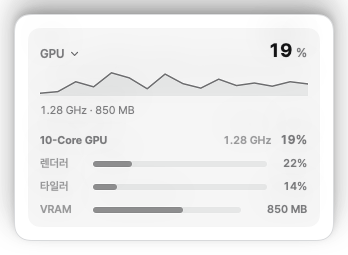
</p>

- **3D 렌더러 & 타일러 사용률**: 실제 그래픽 렌더링 및 컴퓨트 연산 부하를 반영하는 듀얼 파이프라인 점유율 추적.
- **GPU 코어 클럭**: 실시간 GPU 코어 주파수 모니터링.
- **통합 Metal VRAM 할당량**: 동적 사용 메모리(In-Use)와 전체 예약 VRAM 힙(Allocated Heap)을 분리하여 정밀 추적.

### 4. 통합 메모리 및 메모리 압박
<p align="center">
  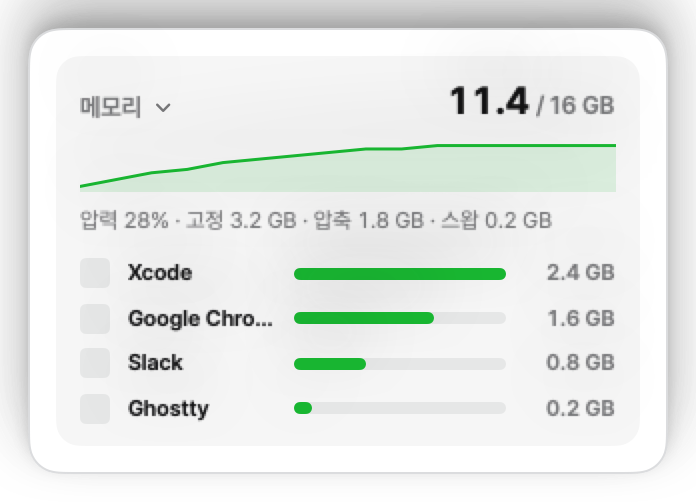
</p>

- **커널 가상 메모리 분해**: `host_statistics64(HOST_VM_INFO64)`를 통해 Active, Wired, Compressed, Swap 페이지를 정확하게 분류.
- **메모리 압박 인덱스**: macOS 페이징 여유도를 직관적인 컬러 게이지로 표시.
- **App-Identity 기반 물리 풋프린트 상위 앱**: 단순 가상 메모리가 아닌 `AppIdentity` 엔진을 통해 `CFBundleIdentifier` 기준 중복을 통합하고 실제 앱 명칭(`CFBundleDisplayName`)과 물리 메모리 점유량(Physical Footprint)을 정확하게 표시.

### 5. 배터리 & 전원 텔레메트리
<p align="center">
  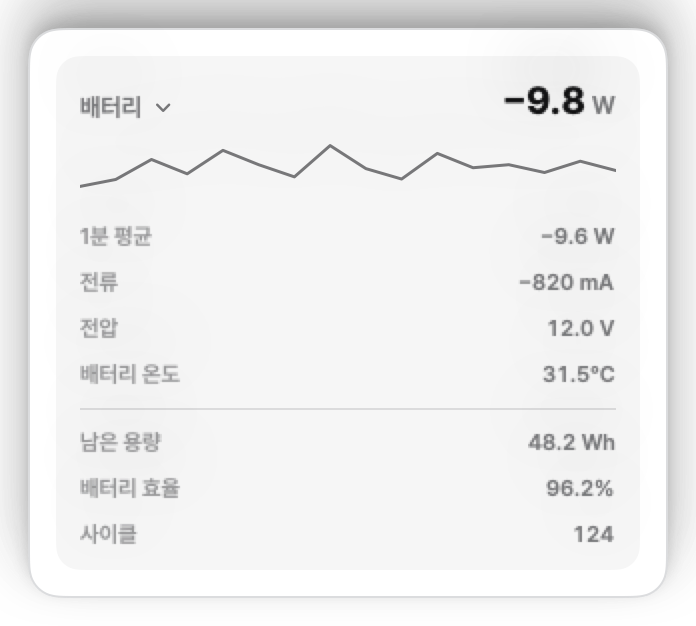
</p>

- **시스템 순방전(Net Discharge, W)**: AppleSMC `B0AP` / `B0AV` × `B0AC` 레지스터로부터 64비트 2의 보수 부호 디코딩을 수행하여, SoC뿐만 아니라 디스플레이 백라이트, SSD, Wi-Fi, 오디오 앰프 등 시스템 전체의 실제 방전/충전 전력 측정.
- **1분 EMA 방전율**: 급격한 변동을 완화하여 안정적인 배터리 잔여 시간 계산.
- **건강도 및 용량 텔레메트리**: 실시간 잔여 용량(mAh/Wh), 배터리 최대 성능치(Health %), 사이클 수, 충전 상태 및 버스 전압/전류 표시.

### 6. 클러스터 발열 및 핫스팟
<p align="center">
  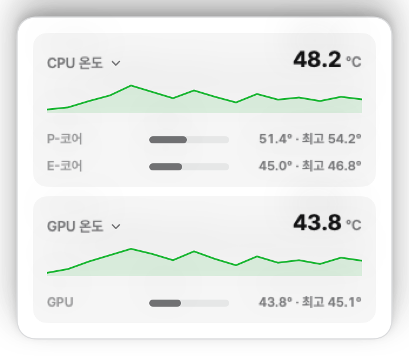
</p>

- **다중 센서 발열 집계**: Apple Silicon M1~M5 전 라인업에 걸쳐 P-Core 클러스터, E-Core 클러스터, GPU 실리콘의 하드웨어 센서 직접 판독.
- **최고 핫스팟 탐지**: 실시간으로 가장 온도가 높은 센서를 감지하여 써멀 스로틀링 위험 구역 식별.
- **써멀 헤드룸 감시**: 대규모 빌드나 렌더링 작업 시 예기치 않은 스로틀링 발생 전 여유 온도 사전 파악.

---

## 배터리 정밀 제어 & 수명 보호

Wattly는 상시 전원 어댑터 연결 환경에서 발생하는 리튬 이온 배터리의 고전압 화학적 열화와 고온 손상을 방지하기 위해 완전한 배터리 관리 슈트(Battery Management Suite)를 제공합니다.

<p align="center">
  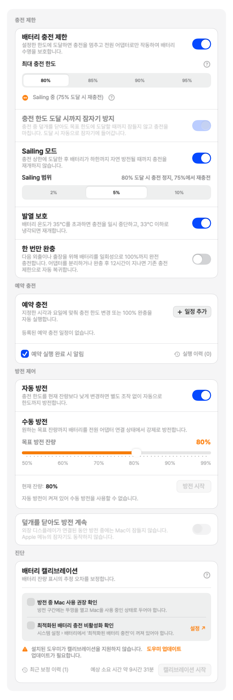
</p>

### 1. 충전 상한 제한 (Charge Limit)
- **맞춤형 상한선 설정**: 80%, 85%, 90%, 95% 등 원하는 배터리 충전 한도를 선택할 수 있습니다.
- **어댑터 패스스루 (AC Bypass)**: 설정한 충전 한도에 도달하면 SMC 레지스터(`CHTE` / `CH0B` / `BCLM`)를 통해 배터리 충전 게이트를 닫고 전원 어댑터로만 Mac을 구동합니다. 배터리 소모나 발열 없이 안전하게 패스스루 전력을 공급합니다.
- **상태 전이 시에만 SMC 쓰기**: 폴링 루프에서 SMC를 지속해서 쓰지 않고 상태가 변할 때만 단 1회 레지스터를 변경하여 `PowerLog` 및 CPU 부하를 원천 차단합니다.

### 2. Sailing 모드 (부동 충전 방지)
- **미세 완충 주기(Micro-cycling) 차단**: 충전 한도에 도달한 후 배터리가 1%만 떨어져도 즉시 다시 충전되는 부동 충전 현상은 배터리 수명을 단축시킵니다.
- **자연 방전 밴드 (2%, 5%, 10%)**: 사용자가 지정한 델타 범위(예: 80% 제한 + 5% Sailing = 75%까지 방전) 동안 배터리가 자연 방전될 때까지 충전을 재개하지 않고 순수 어댑터 전원으로만 시스템을 유지합니다.

### 3. 35°C 발열 보호 (Thermal Hysteresis)
- **고온 충전 차단**: 배터리 온도가 35°C를 초과하면 배터리 수명 보호를 위해 충전을 자동으로 일시 중지합니다.
- **안전 냉각 히스테리시스**: 배터리 온도가 33°C 이하로 충분히 냉각될 때까지 충전을 재개하지 않는 2°C 히스테리시스 밴드를 적용하여 불필요한 충전 온/오프 진동을 방지합니다.

### 4. 한 번만 완충 (One-Time Top-Up)
- **외출 대비 원클릭 100% 충전**: 출장이나 외부 회의를 앞두고 있을 때, 기존 충전 한도 설정을 변경할 필요 없이 클릭 한 번으로 배터리를 100%까지 일회성으로 완전 충전합니다.
- **이중 자동 복귀 메커니즘**: 100% 완충 후 전원 어댑터를 분리하면 기존에 설정해 둔 충전 한도(예: 80%)로 자동 복귀합니다. 어댑터를 계속 꽂아 두더라도 100% 도달 후 12시간이 지나면 헬퍼가 스스로 Top Up을 해제하고 알림을 보냅니다 — 켜 두고 잊어도 배터리가 100%에 무기한 머물지 않습니다.

### 5. 자동 및 수동 강제 방전 (Discharge Control)
- **어댑터 연결 상태에서 강제 방전**: SMC `CHIE` 레지스터 제어를 통해 전원 어댑터가 꽂혀 있는 상태에서도 배터리 전력을 사용하도록 전환하여 원하는 잔량까지 안전하게 방전합니다.
- **자동 방전 (Auto Discharge)**: 충전 한도를 현재 잔량보다 낮게 조정하면(예: 현재 90% 상태에서 한도를 80%로 변경) 추가 조작 없이 자동으로 한도까지 방전합니다.
- **수동 방전 (Manual Discharge)**: 50%~100% 범위의 슬라이더로 목표 잔량을 지정하고 실시간 소모 전력(-W) 및 예상 완료 시간을 확인하며 즉시 방전을 실행할 수 있습니다.

### 6. 충전 스케줄링 (Scheduled Charging)
- **시간대별 맞춤 루틴**: 요일별/시간대별 충전 한도 변경 및 완충 루틴을 스케줄링할 수 있습니다 (예: 평일 오전 8시 100% 완충, 야간 충전 일시 정지).
- **지능형 캐치업 (Catch-up) 정책**: Mac이 잠자기 상태에 있어 스케줄 실행 시점을 놓쳤더라도 화면이 켜지면 30분 이내에 예정되었던 정책을 지능적으로 복구 적용합니다.

---

## 스마트 팬 커브 에디터 & 발열 제어

Wattly는 가벼운 작업 시에는 무소음을 유지하고 장시간의 고부하 작업 시에는 온도를 낮게 유지하도록 정밀한 멀티포인트 팬 커브 엔진을 제공합니다.

<p align="center">
  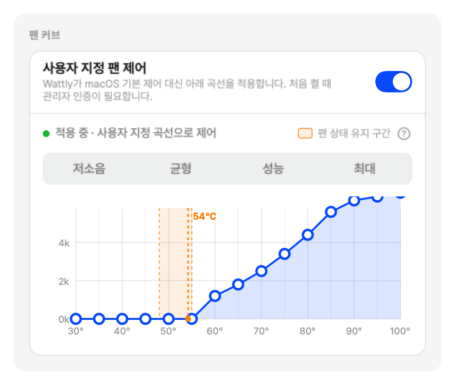
</p>

### 핵심 기능

- **인터랙티브 제어점**: 전체 동작 온도 범위에 걸쳐 마우스 드래그 또는 키보드 조작을 통한 맞춤형 온도-RPM 임계값 구성.
- **상태 유지 구간 (Zero-RPM Hysteresis Zone)**: 48°C~55°C 히스테리시스 밴드를 내장하여 가벼운 작업 시 팬이 켜졌다 꺼지기를 반복하는 소음 방지.
- **최적화된 튜닝 프리셋**:
  - **저소음 (Silent)**: 최대 55°C까지 팬을 정지(0 RPM)하고 65°C 이하에서 최저 RPM으로 유지하여 무소음 환경 보장.
  - **균형 (Balanced)**: 소음과 부품 수명 사이의 최적 균형을 유지하는 표준 리니어 커브.
  - **성능 (Performance)**: 고부하 컴파일이나 게이밍 환경에서 온도를 75°C 이하로 유지하는 공격적인 쿨링 커브.
  - **수동 제어 (Manual Override)**: 특정 벤치마크나 발열 프로파일링을 위한 고정 RPM 수동 설정.
- **팬 부하율(%) 임계값 알림**: 기기마다 다른 최대 RPM(4,000~7,000 RPM)을 고려하여 최대치 대비 상대적 부하율 `FanSample.loadPercent`을 계산하고, 주의(70%) 및 위험(90%) 임계값에 따라 메뉴바 및 팝오버에 시각적 하이라이트 제공.
- **하드웨어 레벨 안전장치**:
  - 실리콘 온도가 100°C를 초과할 경우 즉시 팬 속도를 100% 최대 RPM으로 강제 승격.
  - 15초 하트비트 워치독 타임아웃, 센서 읽기 오류 또는 데몬 종료 시 하드웨어 레지스터를 역판독(Read-back)하여 macOS 커널 기본 제어로의 안전한 복귀를 입증하는 **검증된 안전 릴리즈(Verified Release)** 수행.

---

## Apple Shortcuts (단축어) 연동 및 자동화

Wattly는 최신 **App Intents** 프레임워크를 기반으로 Apple Shortcuts(단축어) 및 Siri와 완벽하게 통합됩니다. 복잡한 시스템 설정 없이 단축어 앱에서 배터리 제어 및 텔레메트리 조회를 자동화할 수 있습니다.

### 지원 App Intents 목록

| 인텐트 명칭 | 설명 | 매개변수 |
| :--- | :--- | :--- |
| `GetBatteryStatusIntent` | 현재 배터리 잔량(%), 충전 상태, 실시간 소비 전력(W), 배터리 온도(°C) 등 종합 상태 조회 | 없음 |
| `GetBatteryLimitIntent` | 현재 설정된 배터리 충전 한도(%), 활성화 여부, Sailing 모드 상태 조회 | 없음 |
| `SetBatteryLimitIntent` | 배터리 최대 충전 한도를 설정하고 충전 제한 기능을 활성화 또는 비활성화 | `limit` (50~100%), `enableLimit` (Bool) |
| `SetBatteryHeatProtectionIntent` | 35°C 배터리 과열 방지 기능을 켜거나 끄고 임계 온도 설정 | `enabled` (Bool), `thresholdCelsius` (30~45°C) |
| `SetBatterySailingIntent` | Sailing 모드 활성화 여부 및 자연 방전 허용 범위(Delta) 설정 | `enabled` (Bool), `delta` (1~10%) |
| `SetBatteryTopUpIntent` | 외출 전 100% 일회성 임시 완충(Top-Up)을 시작하거나 취소 | `start` (Bool) |

### 실전 자동화 워크플로우 예시

- **출근 준비 자동 완충 루틴**:
  - 조건: 평일 오전 7시 알람 해제 시
  - 동작: `SetBatteryTopUpIntent(start: true)` 실행 &rarr; 출근 전 배터리를 100%로 완충하고, 어댑터를 분리하여 출근하거나 완충 후 12시간이 지나면 자동으로 기존 80% 제한으로 복귀.
- **사무실 거치 워크스페이스 모드**:
  - 조건: 회사 Wi-Fi 네트워크에 연결되거나 '업무' 집중 모드 켜짐
  - 동작: `SetBatteryLimitIntent(limit: 80, enableLimit: true)` 및 `SetBatterySailingIntent(enabled: true, delta: 5)` 실행 &rarr; 장시간 어댑터 연결 시 배터리 수명 보호.
- **고부하 작업 발열 보호 자동화**:
  - 조건: 대규모 코드 빌드 또는 영상 렌더링 스크립트 실행 전
  - 동작: `SetBatteryHeatProtectionIntent(enabled: true, thresholdCelsius: 35)` 실행 &rarr; 충전 중 과열 방지.

---

## 아키텍처 & 무권한(Zero-Privilege) 보안 모델

Wattly는 최상의 보안, 시스템 안정성 및 성능을 보장하기 위해 관심사 분리(Separation of Concerns) 원칙을 엄격하게 구현합니다.

<p align="center">
  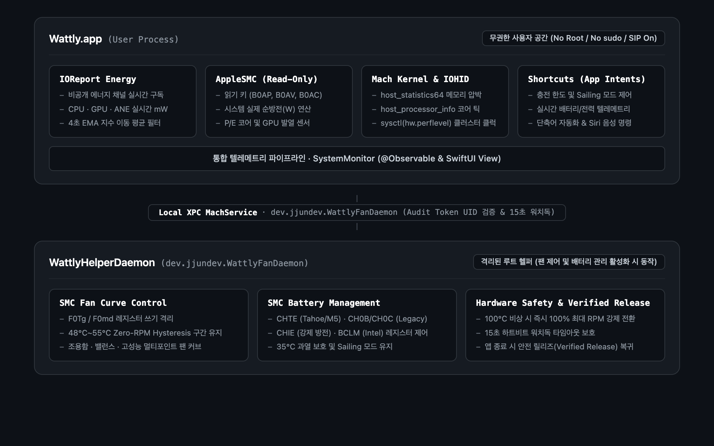
</p>

1. **무권한 텔레메트리 파이프라인 (Reader)**:
   - 표준 일반 사용자 권한(Unprivileged User-Space)으로 100% 동작합니다.
   - `libIOReport.dylib`를 통한 에너지 카운터, SMC 읽기 키를 통한 센서 온도, `host_statistics64`를 통한 가상 메모리, `host_processor_info`를 통한 CPU 틱, `AppIntents` 단축어 인터페이스를 처리합니다.
   - 별도의 헬퍼 도구 설치, `sudo` 권한, 시스템 무결성 보호(SIP) 비활성화가 일체 불필요합니다.

2. **격리된 도우미 데몬 (`WattlyHelperDaemon` / `dev.jjundev.WattlyFanDaemon`)**:
   - 팬 제어 또는 배터리 충전 제한 기능을 명시적으로 활성화할 때만 안전한 단 1회의 관리자 인증 프롬프트를 통해 `launchd` 시스템 서비스로 등록됩니다.
   - 팬 목표 RPM 쓰기(`F0Tg`, `F0md`) 및 배터리 충전 SMC 레지스터(`CHTE`, `CH0B`/`CH0C`, `CHIE`, `BCLM`) 쓰기 작업만 엄격하게 격리되어 처리합니다.
   - 통신은 로컬 XPC MachService로 보호되며, Audit Token UID 검증 및 15초 하트비트 워치독을 통해 안전하게 동작합니다.
   - **검증된 안전 릴리즈 (Verified Release)**: 데몬 종료 또는 비정상 종료 시 SMC 레지스터를 역판독(Read-back)하여 하드웨어가 완전히 정상 macOS 제어로 복귀했는지 검증합니다.

---

## Apple Silicon 호환성 표

Wattly는 Apple Silicon 아키텍처 전용으로 제작되었으며, M1부터 M5까지 모든 세대 및 티어(Base, Pro, Max, Ultra)를 완벽히 지원합니다:

| 세대 | 기본 칩 (Base) | Pro 칩 | Max 칩 | Ultra 칩 | 충전 제어 방식 | macOS 호환성 |
| :--- | :---: | :---: | :---: | :---: | :---: | :---: |
| **Apple M1 시리즈** | M1 | M1 Pro | M1 Max | M1 Ultra | Legacy `CH0B`/`CH0C` & Modern `CHTE` | macOS 14.0+ (Sonoma) / 15.0+ (Sequoia) |
| **Apple M2 시리즈** | M2 | M2 Pro | M2 Max | M2 Ultra | Legacy `CH0B`/`CH0C` & Modern `CHTE` | macOS 14.0+ (Sonoma) / 15.0+ (Sequoia) |
| **Apple M3 시리즈** | M3 | M3 Pro | M3 Max | M3 Ultra | Legacy `CH0B`/`CH0C` & Modern `CHTE` | macOS 14.0+ (Sonoma) / 15.0+ (Sequoia) |
| **Apple M4 시리즈** | M4 | M4 Pro | M4 Max | M4 Ultra | Modern `CHTE` & Legacy `CH0B`/`CH0C` | macOS 14.0+ (Sonoma) / 15.0+ (Sequoia) |
| **Apple M5 시리즈** | M5 | M5 Pro | M5 Max | M5 Ultra | Modern `CHTE` (`ui32` Single Gate) | macOS 14.0+ (Sonoma) / 15.0+ (Sequoia) |

*참고: Apple은 펌웨어 업데이트를 통해 충전 제어 레지스터를 전환하므로, Wattly는 칩 모델이나 OS 버전에 의존하지 않고 하드웨어 SMC 키 존재 여부를 런타임에 직접 프로빙하여 Modern `CHTE`, Legacy `CH0B`/`CH0C`, Intel `BCLM`, macOS 27 펌웨어 관리 모드(`bfF0`/`bfE0`)를 안전하게 판별합니다.*

---

## 설정 및 개인화 가이드

### 메뉴바 스타일 설정
원하는 시각적 스타일과 정보 밀도에 맞춰 메뉴바 표시 항목을 자유롭게 커스터마이징할 수 있습니다:

<p align="center">
  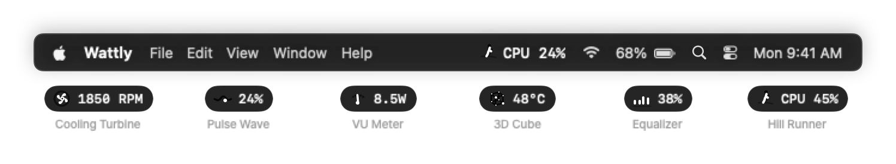
</p>

<p align="center">
  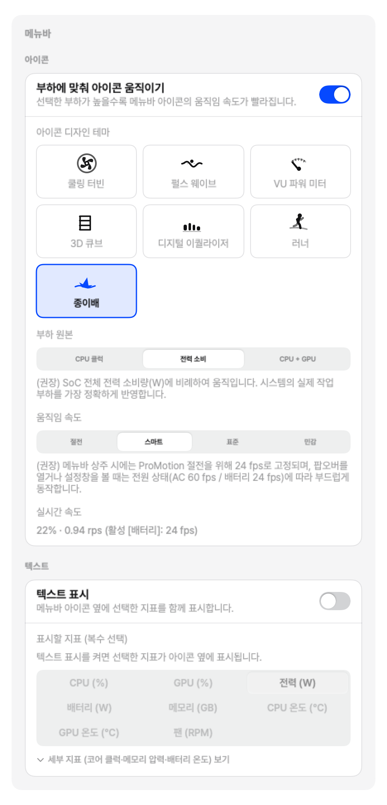
</p>

- **표시 형식**: 아이콘 전용, 실시간 전력(W), CPU 사용률(%), 최고 온도(°C), 또는 복합 지표 조합 중 선택 가능.
- **시각 스타일**: 모던 타이포그래피, 컴팩트 알약 뱃지, 키네틱 펄스 인디케이터.

### 동적 알림 임계값 설정
<p align="center">
  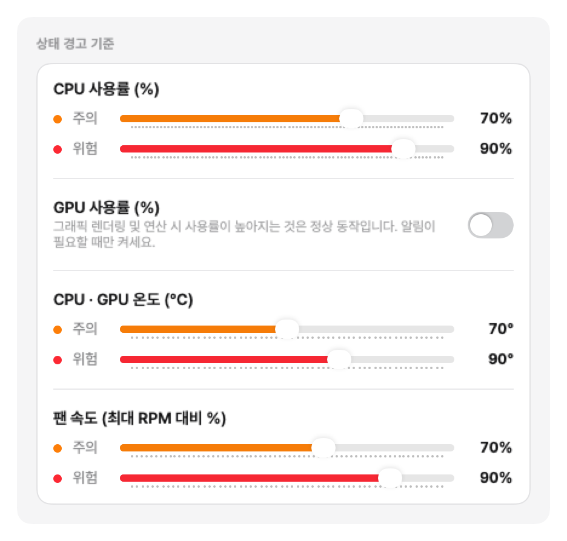
</p>

- SoC 전력(W), CPU 부하(%), 메모리 압박, 핫스팟 온도(°C), 팬 속도(최대 RPM 대비 %)에 대한 맞춤형 주의 및 위험 임계값 슬라이더 제공.
- 시스템 부하나 발열이 설정한 임계값에 도달하면 메뉴바 아이콘 및 팝오버에 즉시 시각적 경고 하이라이트 제공.

### 표시 및 동작 설정
<p align="center">
  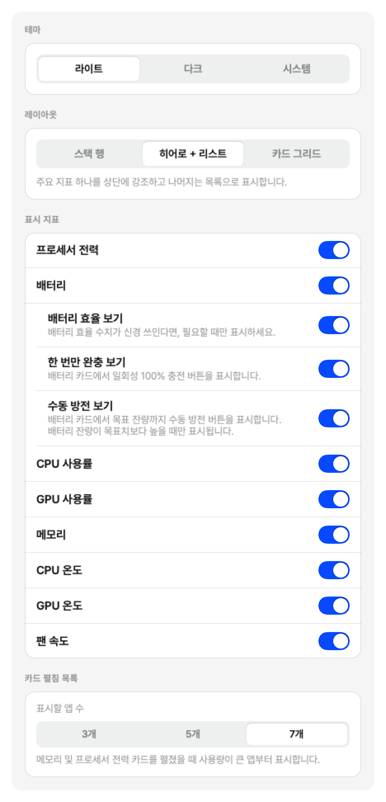
</p>

- **적응형 폴링 주기**: 활성 상태(1~2초) 및 백그라운드 상태(2~5초) 갱신 주기 설정.
- **로그인 시 자동 시작**: `SMAppService`를 통한 깔끔한 시스템 시작 시 자동 실행 구성.
- **온도 단위 설정**: 섭씨(°C) 및 화씨(°F) 전환 지원.
- **글로벌 30+ 언어 지원**: 한국어, 영어, 일본어, 중국어, 독일어, 프랑스어, 스페인어 등 macOS 기본 설정 언어에 맞춘 완벽한 다국어 인터페이스.
- **개발자 문의 및 피드백**: 설정 하단의 '개발자에게 문의하기'를 통해 앱 버전, macOS 빌드, 하드웨어 모델 진단 정보가 자동으로 포함된 Gmail 작성창을 브라우저에서 바로 열 수 있습니다.

---

## 설치 방법

### 옵션 1: Homebrew Cask (권장)

```bash
brew install --cask wattly
```

### 옵션 2: 직접 다운로드

[GitHub Releases](https://github.com/jjundev/project_wattly/releases) 페이지에서 서명된 최신 `.dmg` 설치 파일을 직접 다운로드할 수 있습니다. `Wattly.app`을 `Applications` (응용 프로그램) 폴더로 드래그한 후 실행하세요.

### 옵션 3: 소스 코드 빌드

요구 사항: macOS 14.0+, Xcode 16.0+, [XcodeGen](https://github.com/yonaskolb/XcodeGen).

```bash
# 1. 저장소 클론
git clone https://github.com/jjundev/project_wattly.git
cd project_wattly

# 2. XcodeGen 설치 (미설치 시)
brew install xcodegen

# 3. Xcode 프로젝트 파일 생성
xcodegen generate

# 4. Release 바이너리 빌드
xcodebuild -project Wattly.xcodeproj -scheme Wattly -configuration Release SYMROOT=build build

# 5. 빌드된 앱 실행 및 확인
open build/Release
```

---

## 라이선스

Wattly는 **MIT License**에 따라 배포됩니다. 자세한 내용은 [LICENSE](LICENSE)를 참조하세요.

---

<p align="center">
  Apple Silicon과 macOS를 위해 정밀하게 설계되었습니다.
</p>
