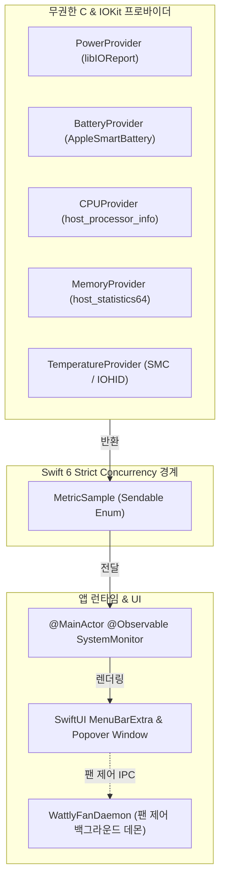
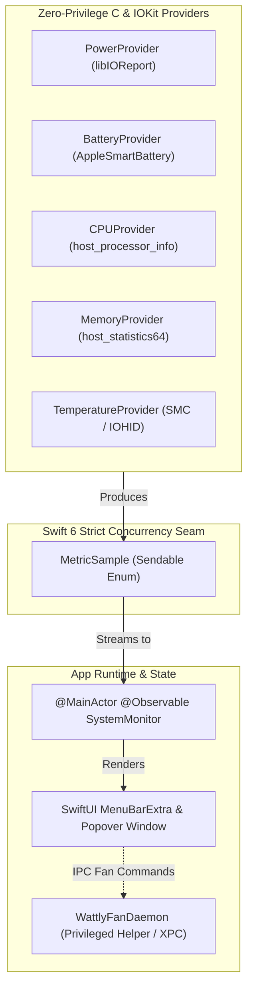

# HTML Landing Page & README Migration Implementation Plan

> **For agentic workers:** REQUIRED SUB-SKILL: Use subagent-driven-development (recommended) or executing-plans to implement this plan task-by-task. Steps use checkbox (`- [ ]`) syntax for tracking.

**Goal:** Migrate `README.md` and `README.ko.md` to reflect the typography, copy, and structural hierarchy of the provided Wattly HTML landing page, while preserving the 6-item expanded hardware telemetry showcase gallery, and publish `docs/index.html` as the interactive standalone web version.

**Architecture:** 
The landing page HTML defines the visual identity, brand voice ("전력을 읽고, 온도를 제어하세요.", "절제된 설계"), 6 feature pillars (`WATTLY가 읽는 정보`), terminal installation pattern, trust model, and compatibility matrix. We transpose this design system into GitHub Flavored Markdown for `README.ko.md` (Korean) and `README.md` (English), and embed the full interactive HTML/CSS/JS in `docs/index.html` for GitHub Pages.

**Tech Stack:** GitHub Flavored Markdown (GFM), HTML5, CSS3 (OKLCH, CSS Grid, Flexbox), Vanilla JS.

## Global Constraints
- Target platform: macOS 14.0+ (Apple Silicon M1 ~ M5)
- Strict compliance with GitHub Markdown HTML Sanitizer (no raw `<style>` or `<script>` in README files)
- Preserve all existing high-contrast 2x Retina screenshot assets in `Resources/` (`screenshot-hero-power-*`, `screenshot-hero-cpu-*`, `screenshot-hero-gpu-*`, `screenshot-hero-mem-*`, `screenshot-hero-temp-*`, `screenshot-hero-battery-*`, `screenshot-settings-*`)
- Symmetrical Korean (`README.ko.md`) and English (`README.md`) documentation

---

### Task 1: Create Standalone Web Landing Page (`docs/index.html`)

**Files:**
- Create: `docs/index.html`

**Interfaces:**
- Produces: Web-accessible landing page ready for GitHub Pages hosting with working theme toggling and clipboard copy interaction.

- [ ] **Step 1: Write `docs/index.html` with complete web markup, CSS, and JS**

```html
<!doctype html>
<html lang="ko">
<head>
  <meta charset="utf-8">
  <meta name="viewport" content="width=device-width, initial-scale=1">
  <meta name="description" content="Wattly — Apple Silicon을 위한 초경량 전력, 발열, 팬 커브 메뉴바 모니터">
  <title>Wattly — Apple Silicon 모니터</title>
  <style>
    :root {
      --bg: oklch(1 0 0);
      --surface: oklch(0.174 0.005 270);
      --surface-soft: oklch(0.974 0.003 264);
      --fg: oklch(0.178 0 0);
      --muted: oklch(0.523 0.023 264);
      --border: oklch(0.881 0.012 264);
      --accent: oklch(0.547 0.236 260);
      --accent-hover: oklch(0.47 0.21 260);
      --font-display: Pretendard, system-ui, -apple-system, "SF Pro Display", "Segoe UI", sans-serif;
      --font-body: Pretendard, system-ui, -apple-system, "SF Pro Text", "Segoe UI", sans-serif;
      --font-mono: "SFMono-Regular", ui-monospace, Menlo, Consolas, monospace;
      --shadow: 0 24px 56px oklch(0.12 0.01 270 / .18), 0 6px 18px oklch(0.12 0.01 270 / .10);
    }
    * { box-sizing: border-box; }
    html { scroll-behavior: smooth; }
    body { margin: 0; background: var(--bg); color: var(--fg); font-family: var(--font-body); font-size: 16px; line-height: 1.75; }
    a { color: inherit; }
    button, a { -webkit-tap-highlight-color: transparent; }
    .shell { width: min(1160px, calc(100% - 48px)); margin: 0 auto; }
    .site-header { height: 76px; display: flex; align-items: center; justify-content: space-between; border-bottom: 1px solid var(--border); }
    .wordmark { display: inline-flex; align-items: center; gap: 10px; font-weight: 700; letter-spacing: -.01em; text-decoration: none; }
    .mark { width: 23px; height: 23px; border-radius: 7px; background: var(--fg); color: var(--bg); display: grid; place-items: center; font-size: 15px; line-height: 1; }
    .site-nav { display: flex; align-items: center; gap: 26px; }
    .site-nav a { color: var(--muted); font-size: 14px; font-weight: 600; letter-spacing: .02em; text-decoration: none; }
    .site-nav a:hover { color: var(--fg); }
    .site-nav a:focus-visible, .text-link:focus-visible, .button:focus-visible, .icon-button:focus-visible, .copy-button:focus-visible { outline: 3px solid var(--accent); outline-offset: 3px; }
    .hero { display: grid; grid-template-columns: minmax(0, .92fr) minmax(380px, 1.08fr); gap: clamp(40px, 7vw, 94px); align-items: center; padding: 96px 0 104px; }
    .eyebrow { display: flex; align-items: center; gap: 9px; margin: 0 0 18px; color: var(--accent); font-size: 12px; font-weight: 700; letter-spacing: .08em; }
    .eyebrow::before { content: ""; width: 7px; height: 7px; border-radius: 50%; background: currentColor; }
    h1, h2, h3, p { margin-top: 0; }
    h1 { max-width: 600px; margin-bottom: 24px; font-family: var(--font-display); font-size: clamp(42px, 5vw, 66px); font-weight: 700; line-height: 1.34; letter-spacing: 0; word-break: keep-all; }
    .hero-copy { max-width: 48ch; margin-bottom: 32px; color: var(--muted); font-size: 18px; line-height: 1.76; word-break: keep-all; }
    .actions { display: flex; flex-wrap: wrap; align-items: center; gap: 18px; }
    .button { min-height: 48px; border: 1px solid transparent; border-radius: 8px; display: inline-flex; align-items: center; justify-content: center; gap: 9px; padding: 0 19px; background: var(--accent); color: var(--bg); font-size: 15px; font-weight: 700; letter-spacing: .02em; text-decoration: none; transition: background .16s ease, transform .16s ease; }
    .button:hover { background: var(--accent-hover); transform: translateY(-2px); }
    .button:active { transform: translateY(0); }
    .text-link { color: var(--fg); font-size: 14px; font-weight: 600; letter-spacing: .02em; text-decoration: underline; text-underline-offset: 5px; text-decoration-color: var(--border); }
    .text-link:hover { text-decoration-color: var(--fg); }
    .product-stage { position: relative; min-height: 570px; display: grid; place-items: center; overflow: hidden; border: 1px solid var(--border); border-radius: 8px; background: var(--surface-soft); }
    .stage-note { position: absolute; left: 24px; top: 20px; z-index: 2; color: var(--muted); font: 600 11px/1 var(--font-mono); letter-spacing: .08em; }
    .mockup { position: relative; width: min(67%, 364px); min-width: 280px; filter: drop-shadow(0 26px 24px oklch(0.12 0.01 270 / .24)); transform: translateY(17px); transition: opacity .2s ease, transform .25s ease; }
    .mockup.light { position: absolute; opacity: 0; transform: translateY(28px); pointer-events: none; }
    .product-stage.is-light { background: oklch(.955 0 0); }
    .product-stage.is-light .mockup.dark { opacity: 0; transform: translateY(28px); }
    .product-stage.is-light .mockup.light { opacity: 1; transform: translateY(17px); }
    .theme-switch { position: absolute; top: 16px; right: 16px; z-index: 3; width: 44px; height: 44px; display: grid; place-items: center; border: 1px solid var(--border); border-radius: 8px; background: var(--bg); color: var(--fg); cursor: pointer; }
    .theme-switch:hover { background: var(--surface-soft); }
    .theme-switch svg { width: 18px; height: 18px; stroke: currentColor; fill: none; stroke-width: 1.8; }
    .section { padding: 104px 0; border-top: 1px solid var(--border); }
    .section-heading { display: grid; grid-template-columns: 1fr 1.22fr; gap: 48px; align-items: start; margin-bottom: 48px; }
    .section-kicker { margin: 0; color: var(--muted); font: 600 12px/1.5 var(--font-mono); letter-spacing: .08em; text-transform: uppercase; }
    h2 { margin-bottom: 0; font-family: var(--font-display); font-size: clamp(30px, 3.5vw, 45px); font-weight: 700; line-height: 1.34; letter-spacing: 0; word-break: keep-all; }
    .feature-grid { display: grid; grid-template-columns: repeat(3, 1fr); border: 1px solid var(--border); border-radius: 8px; overflow: hidden; }
    .feature { min-height: 230px; padding: 28px; background: var(--bg); border-right: 1px solid var(--border); border-bottom: 1px solid var(--border); }
    .feature:nth-child(3n) { border-right: 0; }
    .feature:nth-last-child(-n + 3) { border-bottom: 0; }
    .feature svg { width: 24px; height: 24px; margin-bottom: 42px; stroke: var(--fg); fill: none; stroke-width: 1.75; }
    .feature h3 { margin-bottom: 9px; font-size: 18px; line-height: 1.45; letter-spacing: -.01em; word-break: keep-all; }
    .feature p { margin-bottom: 0; color: var(--muted); font-size: 14px; line-height: 1.7; word-break: keep-all; }
    .install-layout { display: grid; grid-template-columns: .85fr 1.15fr; gap: 64px; align-items: center; }
    .install-copy { max-width: 38ch; margin: 20px 0 0; color: var(--muted); word-break: keep-all; }
    .terminal { position: relative; overflow: hidden; border-radius: 8px; background: var(--surface); color: oklch(.97 0 0); box-shadow: var(--shadow); }
    .terminal-top { height: 52px; display: flex; align-items: center; gap: 7px; padding: 0 18px; border-bottom: 1px solid oklch(.42 .012 270); }
    .dot { width: 8px; height: 8px; border-radius: 50%; background: oklch(.72 0 0); }
    .terminal-title { margin-left: 7px; color: oklch(.77 .01 270); font: 500 12px/1 var(--font-mono); }
    .terminal pre { margin: 0; padding: 28px 28px 30px; overflow-x: auto; font: 500 15px/1.8 var(--font-mono); white-space: pre-wrap; }
    .prompt { color: oklch(.79 .01 270); }
    .copy-button { position: absolute; right: 15px; bottom: 15px; min-height: 36px; border: 1px solid oklch(.48 .012 270); border-radius: 8px; padding: 0 12px; background: transparent; color: oklch(.95 0 0); font: 600 12px/1 var(--font-body); letter-spacing: .02em; cursor: pointer; }
    .copy-button:hover { background: oklch(.28 .007 270); }
    .copy-button.is-copied { border-color: oklch(.69 0 0); }
    .trust-grid { display: grid; grid-template-columns: 1.1fr .9fr; gap: 20px; }
    .trust-main, .trust-list { border: 1px solid var(--border); border-radius: 8px; }
    .trust-main { padding: 42px; background: var(--surface-soft); }
    .trust-main strong { display: block; margin-bottom: 16px; font-family: var(--font-display); font-size: clamp(28px, 3.2vw, 40px); line-height: 1.35; letter-spacing: 0; word-break: keep-all; }
    .trust-main p { max-width: 52ch; margin: 0; color: var(--muted); font-size: 15px; word-break: keep-all; }
    .trust-list { padding: 8px 28px; }
    .trust-item { display: grid; grid-template-columns: 34px 1fr; gap: 16px; align-items: start; padding: 23px 0; border-bottom: 1px solid var(--border); }
    .trust-item:last-child { border-bottom: 0; }
    .trust-num { color: var(--muted); font: 600 12px/1.7 var(--font-mono); }
    .trust-item h3 { margin: 0 0 4px; font-size: 16px; line-height: 1.4; }
    .trust-item p { margin: 0; color: var(--muted); font-size: 14px; line-height: 1.65; word-break: keep-all; }
    .compatibility { border: 1px solid var(--border); border-radius: 8px; overflow: hidden; }
    .compat-row { display: grid; grid-template-columns: 1.3fr repeat(4, .72fr); align-items: center; min-height: 68px; border-bottom: 1px solid var(--border); }
    .compat-row:last-child { border-bottom: 0; }
    .compat-row > * { padding: 12px 20px; }
    .compat-head { background: var(--surface-soft); color: var(--muted); font-size: 12px; font-weight: 700; letter-spacing: .02em; }
    .chip-name { font-size: 15px; font-weight: 700; }
    .yes { font-size: 14px; font-weight: 600; text-align: center; }
    .yes::before { content: "✓"; margin-right: 6px; }
    .source-note { margin: 14px 0 0; color: var(--muted); font-size: 13px; }
    .footer { padding: 40px 0 48px; border-top: 1px solid var(--border); }
    .footer-inner { display: flex; align-items: center; justify-content: space-between; gap: 24px; }
    .footer-copy { margin: 0; color: var(--muted); font-size: 13px; }
    .footer-links { display: flex; flex-wrap: wrap; gap: 18px; }
    .footer-links a { color: var(--muted); font-size: 13px; font-weight: 600; text-decoration: none; }
    .footer-links a:hover { color: var(--fg); text-decoration: underline; text-underline-offset: 4px; }
    @media (max-width: 820px) {
      .site-nav { gap: 16px; }
      .hero, .section-heading, .install-layout, .trust-grid { grid-template-columns: 1fr; }
      .hero { padding: 72px 0 80px; }
      .product-stage { min-height: 480px; }
      .feature-grid { grid-template-columns: repeat(2, 1fr); }
      .feature:nth-child(3n) { border-right: 1px solid var(--border); }
      .feature:nth-child(2n) { border-right: 0; }
      .feature:nth-last-child(-n + 3) { border-bottom: 1px solid var(--border); }
      .feature:nth-last-child(-n + 2) { border-bottom: 0; }
      .section { padding: 80px 0; }
      .section-heading { gap: 18px; margin-bottom: 36px; }
    }
    @media (max-width: 580px) {
      .shell { width: min(100% - 32px, 1160px); }
      .site-header { height: 66px; }
      .site-nav a:not(:last-child) { display: none; }
      h1 { font-size: 40px; }
      .hero-copy { font-size: 16px; }
      .product-stage { min-height: 440px; }
      .mockup { width: 77%; min-width: 245px; }
      .feature-grid { grid-template-columns: 1fr; }
      .feature, .feature:nth-child(3n), .feature:nth-child(2n) { min-height: 190px; border-right: 0; border-bottom: 1px solid var(--border); }
      .feature:last-child { border-bottom: 0; }
      .feature svg { margin-bottom: 28px; }
      .compatibility { overflow-x: auto; }
      .compat-row { min-width: 630px; }
      .footer-inner { align-items: flex-start; flex-direction: column; }
    }
    @media (prefers-reduced-motion: reduce) { *, *::before, *::after { scroll-behavior: auto !important; transition-duration: .01ms !important; } }
  </style>
</head>
<body>
  <div class="shell">
    <header class="site-header" data-od-id="site-header">
      <a class="wordmark" href="#top" data-od-id="wattly-wordmark"><span class="mark" aria-hidden="true">⚡</span>Wattly</a>
      <nav class="site-nav" aria-label="주요 메뉴" data-od-id="main-navigation">
        <a href="#features" data-od-id="nav-features">기능</a>
        <a href="#showcase" data-od-id="nav-showcase">화면 미리보기</a>
        <a href="#privacy" data-od-id="nav-privacy">원칙</a>
        <a href="#compatibility" data-od-id="nav-compatibility">호환성</a>
        <a href="https://github.com/jjundev/project_wattly" target="_blank" rel="noreferrer" data-od-id="nav-github">GitHub ↗</a>
      </nav>
    </header>

    <main id="top">
      <section class="hero" data-od-id="hero-section">
        <div>
          <p class="eyebrow" data-od-id="hero-eyebrow">APPLE SILICON · macOS 14+</p>
          <h1 data-od-id="hero-title">전력을 읽고,<br>온도를 제어하세요.</h1>
          <p class="hero-copy" data-od-id="hero-description">Wattly는 Apple Silicon Mac을 위한 초경량 메뉴바 모니터입니다. 전력·발열·배터리를 권한 없이 읽고, 필요한 순간에는 정교한 팬 커브까지 제어합니다.</p>
          <div class="actions" data-od-id="hero-actions">
            <a class="button" href="https://github.com/jjundev/project_wattly/releases/latest" target="_blank" rel="noreferrer" data-od-id="release-cta">최신 릴리스 받기 <span aria-hidden="true">↗</span></a>
            <a class="text-link" href="#install" data-od-id="install-link">설치 방법 보기</a>
          </div>
        </div>
        <div class="product-stage" data-od-id="product-preview" aria-label="Wattly 메뉴바 팝오버 미리보기">
          <span class="stage-note">실시간 측정 화면</span>
          <button class="theme-switch" type="button" aria-label="제품 화면 테마 전환" aria-pressed="false" data-od-id="theme-toggle">
            <svg viewBox="0 0 24 24" aria-hidden="true"><circle cx="12" cy="12" r="4"></circle><path d="M12 2v2M12 20v2M4.93 4.93l1.41 1.41M17.66 17.66l1.41 1.41M2 12h2M20 12h2M4.93 19.07l1.41-1.41M17.66 6.34l1.41-1.41"></path></svg>
          </button>
          
          
        </div>
      </section>

      <section class="section" id="features" data-od-id="features-section">
        <div class="section-heading">
          <p class="section-kicker" data-od-id="features-kicker">WATTLY가 읽는 정보</p>
          <h2 data-od-id="features-heading">Mac이 지금 쓰는 에너지와 열을, 맥락까지 함께 보여줍니다.</h2>
        </div>
        <div class="feature-grid" data-od-id="feature-grid">
          <article class="feature" data-od-id="feature-card-soc-power"><svg viewBox="0 0 24 24" aria-hidden="true"><path d="M13 2 4 14h7l-1 8 10-13h-7z"></path></svg><h3>SoC 전력 분해</h3><p>CPU, GPU, ANE, 패키지 전력을 libIOReport로 실시간 분리해 읽습니다.</p></article>
          <article class="feature" data-od-id="feature-card-battery"><svg viewBox="0 0 24 24" aria-hidden="true"><rect x="3" y="6" width="17" height="12" rx="2"></rect><path d="M21 10v4M7 10h5"></path></svg><h3>순 방전과 배터리 상태</h3><p>와트·전압·전류·배터리 건강도·사이클을 AppleSmartBattery에서 확인합니다.</p></article>
          <article class="feature" data-od-id="feature-card-thermals"><svg viewBox="0 0 24 24" aria-hidden="true"><path d="M14 14.76V5a2 2 0 0 0-4 0v9.76a4 4 0 1 0 4 0Z"></path><path d="M12 11v6"></path></svg><h3>검증된 핫스팟 온도</h3><p>M 시리즈 센서 프로필을 바탕으로 CPU·GPU 최고 온도를 명확하게 전달합니다.</p></article>
          <article class="feature" data-od-id="feature-card-fan"><svg viewBox="0 0 24 24" aria-hidden="true"><circle cx="12" cy="12" r="2"></circle><path d="M12 4c2-2 6-1 6 2 0 2-2 4-4 4M19 14c2 2 1 6-2 6-2 0-4-2-4-4M8 19c-2 2-6 1-6-2 0-2 2-4 4-4M5 10c-2-2-1-6 2-6 2 0 4 2 4 4"></path></svg><h3>스마트 팬 커브</h3><p>Silent·Balanced·Max 프리셋과 온도별 RPM 커브로 냉각 방식을 조절합니다.</p></article>
          <article class="feature" data-od-id="feature-card-low-power"><svg viewBox="0 0 24 24" aria-hidden="true"><path d="M12 2v10"></path><path d="M7.05 4.93a8 8 0 1 0 9.9 0"></path></svg><h3>스스로를 아끼는 엔진</h3><p>패널을 닫으면 폴링을 완화하고, 지속적인 Metal GPU 오버헤드를 만들지 않습니다.</p></article>
          <article class="feature" data-od-id="feature-card-sparklines"><svg viewBox="0 0 24 24" aria-hidden="true"><path d="M3 19V5M3 19h18"></path><path d="m6 15 4-4 3 2 5-6"></path></svg><h3>60초 동적 추이</h3><p>작은 스파크라인으로 전력·부하·발열의 최근 흐름을 빠르게 파악합니다.</p></article>
        </div>
      </section>

      <section class="section" id="install" data-od-id="install-section">
        <div class="install-layout">
          <div>
            <p class="section-kicker" data-od-id="install-kicker">INSTALL</p>
            <h2 data-od-id="install-heading">터미널 한 줄로<br>시작할 수 있습니다.</h2>
            <p class="install-copy" data-od-id="install-description">Homebrew로 설치하거나, GitHub Releases에서 최신 공증 DMG를 받아 Applications 폴더로 옮기세요.</p>
          </div>
          <div class="terminal" data-od-id="install-terminal">
            <div class="terminal-top"><span class="dot"></span><span class="dot"></span><span class="dot"></span><span class="terminal-title">터미널</span></div>
            <pre><span class="prompt">% </span>brew tap jjundev/wattly
<span class="prompt">% </span>brew install --cask wattly</pre>
            <button class="copy-button" type="button" data-od-id="copy-install-command">명령 복사</button>
          </div>
        </div>
      </section>

      <section class="section" id="privacy" data-od-id="privacy-section">
        <div class="section-heading">
          <p class="section-kicker" data-od-id="privacy-kicker">절제된 설계</p>
          <h2 data-od-id="privacy-heading">관리자 권한도, 원격 분석도 없이. 맥 안에서만 동작합니다.</h2>
        </div>
        <div class="trust-grid" data-od-id="trust-grid">
          <div class="trust-main" data-od-id="trust-highlight"><strong>하드웨어를 더 깊이 보되,<br>개인정보에는 닿지 않습니다.</strong><p>Wattly는 macOS의 사용자 공간 C·IOKit API를 통해 정보를 수집합니다. 데이터는 사용자의 Mac 밖으로 나가지 않으며, 화면이 닫힌 때에는 필요한 만큼만 측정합니다.</p></div>
          <div class="trust-list" data-od-id="trust-list">
            <article class="trust-item" data-od-id="trust-item-zero-root"><span class="trust-num">01</span><div><h3>관리자 권한 없음</h3><p>커널 확장이나 관리자 비밀번호 없이 운영됩니다.</p></div></article>
            <article class="trust-item" data-od-id="trust-item-concurrency"><span class="trust-num">02</span><div><h3>Swift 6 Strict Concurrency</h3><p>측정과 UI 사이의 경계를 명확히 둔 구조입니다.</p></div></article>
            <article class="trust-item" data-od-id="trust-item-local"><span class="trust-num">03</span><div><h3>100% 로컬</h3><p>원격 분석 없이, 측정 데이터는 사용자의 Mac에만 남습니다.</p></div></article>
          </div>
        </div>
      </section>

      <section class="section" id="compatibility" data-od-id="compatibility-section">
        <div class="section-heading">
          <p class="section-kicker" data-od-id="compatibility-kicker">Apple Silicon</p>
          <h2 data-od-id="compatibility-heading">M1부터 M5까지,<br>현재의 Apple Silicon을 지원합니다.</h2>
        </div>
        <div class="compatibility" data-od-id="compatibility-table" role="table" aria-label="Wattly 하드웨어 지원 매트릭스">
          <div class="compat-row compat-head" role="row"><span>칩셋 라인업</span><span>SoC 전력</span><span>순 방전</span><span>CPU / GPU 온도</span><span>팬 제어</span></div>
          <div class="compat-row" role="row" data-od-id="compat-m1"><span class="chip-name">Apple M1 · Pro · Max · Ultra</span><span class="yes">지원</span><span class="yes">지원</span><span class="yes">검증</span><span class="yes">지원</span></div>
          <div class="compat-row" role="row" data-od-id="compat-m2"><span class="chip-name">Apple M2 · Pro · Max · Ultra</span><span class="yes">지원</span><span class="yes">지원</span><span class="yes">검증</span><span class="yes">지원</span></div>
          <div class="compat-row" role="row" data-od-id="compat-m3"><span class="chip-name">Apple M3 · Pro · Max</span><span class="yes">지원</span><span class="yes">지원</span><span class="yes">검증</span><span class="yes">지원</span></div>
          <div class="compat-row" role="row" data-od-id="compat-m4"><span class="chip-name">Apple M4 · Pro · Max</span><span class="yes">지원</span><span class="yes">지원</span><span class="yes">검증</span><span class="yes">지원</span></div>
          <div class="compat-row" role="row" data-od-id="compat-m5"><span class="chip-name">Apple M5 시리즈</span><span class="yes">지원</span><span class="yes">지원</span><span class="yes">검증</span><span class="yes">지원</span></div>
        </div>
        <p class="source-note" data-od-id="compatibility-note">지원 현황은 프로젝트 README의 하드웨어 매트릭스를 기준으로 정리했습니다.</p>
      </section>
    </main>

    <footer class="footer" data-od-id="site-footer">
      <div class="footer-inner">
        <p class="footer-copy">Wattly · MIT License · Apple Silicon용 오픈 소스 메뉴바 모니터</p>
        <div class="footer-links" data-od-id="footer-links"><a href="https://github.com/jjundev/project_wattly" target="_blank" rel="noreferrer">GitHub</a><a href="https://github.com/jjundev/project_wattly/blob/main/CONTRIBUTING.md" target="_blank" rel="noreferrer">기여하기</a><a href="https://github.com/jjundev/project_wattly/blob/main/LICENSE" target="_blank" rel="noreferrer">MIT License</a></div>
      </div>
    </footer>
  </div>
  <script>
    const stage = document.querySelector('[data-od-id="product-preview"]');
    const themeToggle = document.querySelector('[data-od-id="theme-toggle"]');
    const copyButton = document.querySelector('[data-od-id="copy-install-command"]');
    const installCommand = 'brew tap jjundev/wattly\nbrew install --cask wattly';
    themeToggle.addEventListener('click', () => {
      const isLight = stage.classList.toggle('is-light');
      themeToggle.setAttribute('aria-pressed', String(isLight));
      themeToggle.setAttribute('aria-label', isLight ? '제품 화면을 어두운 테마로 전환' : '제품 화면을 밝은 테마로 전환');
    });
    copyButton.addEventListener('click', async () => {
      try {
        await navigator.clipboard.writeText(installCommand);
        copyButton.textContent = '복사됨';
        copyButton.classList.add('is-copied');
      } catch (error) {
        copyButton.textContent = '직접 복사';
      }
      window.setTimeout(() => { copyButton.textContent = '명령 복사'; copyButton.classList.remove('is-copied'); }, 1800);
    });
  </script>
</body>
</html>
```

- [ ] **Step 2: Verify `docs/index.html` file integrity**

Run: `ls -la docs/index.html`
Expected: File exists with non-zero size.

- [ ] **Step 3: Commit**

```bash
git add docs/index.html
git commit -m "feat(web): add standalone landing page with theme switch and quick install"
```

---

### Task 2: Migrate Korean README (`README.ko.md`) to HTML Editorial Design

**Files:**
- Modify: `README.ko.md`

**Interfaces:**
- Consumes: Resources screenshots and HTML landing page copy.
- Produces: Complete Korean README adhering to the HTML structure (Wordmark Header, "전력을 읽고, 온도를 제어하세요.", 6 Feature Pillars, Hardware Telemetry Showcase, Terminal Install, Principled Architecture, Hardware Matrix).

- [ ] **Step 1: Write redesigned `README.ko.md`**

```markdown
<div align="center">

# ⚡ Wattly

<p align="center">
  <b>APPLE SILICON · macOS 14+</b><br/>
  <h1>전력을 읽고,<br>온도를 제어하세요.</h1>
</p>

<p align="center">
  Wattly는 Apple Silicon Mac을 위한 초경량 메뉴바 모니터입니다.<br/>
  전력·발열·배터리를 권한 없이 읽고, 필요한 순간에는 정교한 팬 커브까지 제어합니다.
</p>

<p align="center">
  <a href="https://github.com/jjundev/project_wattly/releases/latest"><b>📥 최신 릴리스 받기 (DMG)</b></a> •
  <a href="#-설치-방법"><b>⚡ 설치 방법 보기</b></a> •
  <a href="./README.md"><b>🇺🇸 English Version</b></a>
</p>

<br/>

<picture>
  <source media="(prefers-color-scheme: dark)" srcset="./Resources/screenshot-hero-power-dark.png">
  <source media="(prefers-color-scheme: light)" srcset="./Resources/screenshot-hero-power-light.png">
  
</picture>

</div>

---

## ⚡ WATTLY가 읽는 정보

> Mac이 지금 쓰는 에너지와 열을, 맥락까지 함께 보여줍니다.

<table width="100%">
  <tr>
    <td width="33.3%" valign="top">
      <h4>⚡ SoC 전력 분해</h4>
      <p>CPU, GPU, ANE, 패키지 전력을 <code>libIOReport</code>로 실시간 분리해 읽습니다.</p>
    </td>
    <td width="33.3%" valign="top">
      <h4>🔋 순 방전과 배터리 상태</h4>
      <p>와트·전압·전류·배터리 건강도·사이클을 <code>AppleSmartBattery</code>에서 확인합니다.</p>
    </td>
    <td width="33.3%" valign="top">
      <h4>🌡️ 검증된 핫스팟 온도</h4>
      <p>M 시리즈 센서 프로필을 바탕으로 CPU·GPU 최고 온도를 명확하게 전달합니다.</p>
    </td>
  </tr>
  <tr>
    <td width="33.3%" valign="top">
      <h4>🌪️ 스마트 팬 커브</h4>
      <p>Silent·Balanced·Max 프리셋과 온도별 RPM 커브로 냉각 방식을 조절합니다.</p>
    </td>
    <td width="33.3%" valign="top">
      <h4>🪶 스스로를 아끼는 엔진</h4>
      <p>패널을 닫으면 폴링을 완화하고, 지속적인 Metal GPU 오버헤드를 만들지 않습니다.</p>
    </td>
    <td width="33.3%" valign="top">
      <h4>📊 60초 동적 추이</h4>
      <p>작은 스파크라인으로 전력·부하·발열의 최근 흐름을 빠르게 파악합니다.</p>
    </td>
  </tr>
</table>

---

## 🖼️ 주요 화면 미리보기 (Showcase)

### 🔍 하드웨어 세부 지표 정밀 분해 (Hero Promoted Views)

<table width="100%">
  <tr>
    <td width="50%" align="center" valign="top">
      <h4>⚡ SoC 전력 & 프로세스 정밀 분석</h4>
      <p align="center"><i>CPU, GPU, ANE 개별 소모량(W) 분해 및 상위 전력 소모 앱 목록.</i></p>
      <picture>
        <source media="(prefers-color-scheme: dark)" srcset="./Resources/screenshot-hero-power-dark.png">
        <source media="(prefers-color-scheme: light)" srcset="./Resources/screenshot-hero-power-light.png">
        
      </picture>
    </td>
    <td width="50%" align="center" valign="top">
      <h4>💻 CPU 코어 클러스터 & 주파수</h4>
      <p align="center"><i>P-코어/E-코어 실시간 클럭(GHz) 및 각 코어별 부하율 막대 차트.</i></p>
      <picture>
        <source media="(prefers-color-scheme: dark)" srcset="./Resources/screenshot-hero-cpu-dark.png">
        <source media="(prefers-color-scheme: light)" srcset="./Resources/screenshot-hero-cpu-light.png">
        
      </picture>
    </td>
  </tr>
  <tr>
    <td width="50%" align="center" valign="top">
      <h4>🎮 GPU 파이프라인 & VRAM 감시</h4>
      <p align="center"><i>GPU 동작 클럭(GHz), 렌더러/타일러 부하율, VRAM 실사용량.</i></p>
      <picture>
        <source media="(prefers-color-scheme: dark)" srcset="./Resources/screenshot-hero-gpu-dark.png">
        <source media="(prefers-color-scheme: light)" srcset="./Resources/screenshot-hero-gpu-light.png">
        
      </picture>
    </td>
    <td width="50%" align="center" valign="top">
      <h4>🧠 메모리 압력 & 앱별 점유율</h4>
      <p align="center"><i>시스템 메모리 압력 %, 고정/압축/스왑 수치 및 앱별 메모리 점유.</i></p>
      <picture>
        <source media="(prefers-color-scheme: dark)" srcset="./Resources/screenshot-hero-mem-dark.png">
        <source media="(prefers-color-scheme: light)" srcset="./Resources/screenshot-hero-mem-light.png">
        
      </picture>
    </td>
  </tr>
  <tr>
    <td width="50%" align="center" valign="top">
      <h4>🌡️ CPU & GPU 클러스터 발열</h4>
      <p align="center"><i>P-코어, E-코어, GPU 클러스터별 평균 및 최고 피크 핫스팟 온도.</i></p>
      <picture>
        <source media="(prefers-color-scheme: dark)" srcset="./Resources/screenshot-hero-temp-dark.png">
        <source media="(prefers-color-scheme: light)" srcset="./Resources/screenshot-hero-temp-light.png">
        
      </picture>
    </td>
    <td width="50%" align="center" valign="top">
      <h4>🔋 배터리 순방전·수명 텔레메트리</h4>
      <p align="center"><i>실시간 방전율(W), 잔여 용량, 배터리 수명, 사이클, 전압 및 전류.</i></p>
      <picture>
        <source media="(prefers-color-scheme: dark)" srcset="./Resources/screenshot-hero-battery-dark.png">
        <source media="(prefers-color-scheme: light)" srcset="./Resources/screenshot-hero-battery-light.png">
        
      </picture>
    </td>
  </tr>
</table>

### ⚙️ 설정 & 지능형 제어 탭 (Settings Tabs)

<table width="100%">
  <tr>
    <td width="33.3%" align="center" valign="top">
      <h4>🌪️ 스마트 팬 제어</h4>
      <p align="center"><i>인터랙티브 커브 에디터, 4대 프리셋, Zero-RPM 무소음 밴드.</i></p>
      <picture>
        <source media="(prefers-color-scheme: dark)" srcset="./Resources/screenshot-settings-fan-dark.png">
        <source media="(prefers-color-scheme: light)" srcset="./Resources/screenshot-settings-fan-light.png">
        
      </picture>
    </td>
    <td width="33.3%" align="center" valign="top">
      <h4>⚙️ 표시 & 메뉴바</h4>
      <p align="center"><i>다크/라이트 테마, 3종 레이아웃 모드, 메뉴바 텍스트 칩 커스텀.</i></p>
      <picture>
        <source media="(prefers-color-scheme: dark)" srcset="./Resources/screenshot-settings-display-dark.png">
        <source media="(prefers-color-scheme: light)" srcset="./Resources/screenshot-settings-display-light.png">
        
      </picture>
    </td>
    <td width="33.3%" align="center" valign="top">
      <h4>⏱️ 동작 & 갱신 주기</h4>
      <p align="center"><i>절전(에코)/고성능 적응형 폴링 정책 및 EMA 전력 안정화.</i></p>
      <picture>
        <source media="(prefers-color-scheme: dark)" srcset="./Resources/screenshot-settings-behavior-dark.png">
        <source media="(prefers-color-scheme: light)" srcset="./Resources/screenshot-settings-behavior-light.png">
        
      </picture>
    </td>
  </tr>
</table>

---

## 📥 설치 방법

### 1. Homebrew Cask (터미널 한 줄 설치)
```zsh
brew tap jjundev/wattly
brew install --cask wattly
```

### 2. 직접 다운로드 (공증 DMG)
[GitHub Releases](https://github.com/jjundev/project_wattly/releases/latest)에서 공증(Notarized)된 최신 `.dmg` 파일을 다운로드하여 `Applications` 폴더로 드래그합니다.

### 3. 소스코드 직접 빌드
```zsh
git clone https://github.com/jjundev/project_wattly.git
cd project_wattly
xcodegen generate
xcodebuild -scheme Wattly -configuration Release build
```

---

## 🛡️ 절제된 설계 (Principled Architecture)

> [!NOTE]
> **하드웨어를 더 깊이 보되, 개인정보에는 닿지 않습니다.**  
> Wattly는 macOS의 사용자 공간 C·IOKit API를 통해 정보를 수집합니다. 데이터는 사용자의 Mac 밖으로 나가지 않으며, 화면이 닫힌 때에는 필요한 만큼만 측정합니다.

* **01. 관리자 권한 없음 (Zero Root / No Sudo)**: 커널 확장(KEXT)이나 관리자 비밀번호 입력 없이 순수 유저스페이스에서 구동됩니다.
* **02. Swift 6 Strict Concurrency**: 데이터 측정(`MetricSample`)과 UI 렌더링 사이의 액터 경계를 엄격히 격리하여 스레드 안전성을 보장합니다.
* **03. 100% 로컬 & 프라이버시**: 어떠한 원격 텔레메트리나 분석 도구도 포함하지 않으며, 모든 측정 데이터는 Mac 내부에만 유지됩니다.



---

## 🗺️ Apple Silicon 지원 매트릭스

| 칩셋 라인업 | SoC 전력 (libIOReport) | 순 방전 (AppleSmartBattery) | CPU / GPU 온도 | 팬 제어 |
| :--- | :---: | :---: | :---: | :---: |
| **Apple M1 · Pro · Max · Ultra** | ✅ 지원 | ✅ 지원 | ✅ 검증 | ✅ 지원 |
| **Apple M2 · Pro · Max · Ultra** | ✅ 지원 | ✅ 지원 | ✅ 검증 | ✅ 지원 |
| **Apple M3 · Pro · Max** | ✅ 지원 | ✅ 지원 | ✅ 검증 | ✅ 지원 |
| **Apple M4 · Pro · Max** | ✅ 지원 | ✅ 지원 | ✅ 검증 | ✅ 지원 |
| **Apple M5 시리즈** | ✅ 지원 | ✅ 지원 | ✅ 검증 | ✅ 지원 |

---

## 📄 라이선스 및 기여

* **라이선스**: Wattly는 [MIT License](./LICENSE) 하에 자유롭게 사용 및 배포 가능합니다.
* **기여하기**: 센서 프로필 제보 및 기여 가이드는 [CONTRIBUTING.md](./CONTRIBUTING.md)를 참고해 주세요.
```

- [ ] **Step 2: Verify `README.ko.md` file integrity**

Run: `view_file` on `README.ko.md`
Expected: Correct markdown syntax, valid links, no broken tags.

- [ ] **Step 3: Commit**

```bash
git add README.ko.md
git commit -m "docs: migrate README.ko.md to HTML landing page design language and structure"
```

---

### Task 3: Migrate English README (`README.md`) to HTML Editorial Design

**Files:**
- Modify: `README.md`

**Interfaces:**
- Consumes: HTML landing page copy translated to idiomatic English and Resources screenshots.
- Produces: Symmetrical English README matching `README.ko.md`.

- [ ] **Step 1: Write redesigned `README.md`**

```markdown
<div align="center">

# ⚡ Wattly

<p align="center">
  <b>APPLE SILICON · macOS 14+</b><br/>
  <h1>Read power,<br>control thermals.</h1>
</p>

<p align="center">
  Wattly is an ultra-lightweight menu bar monitor crafted for Apple Silicon Macs.<br/>
  Read power, thermals, and battery metrics without root privileges, and fine-tune custom fan curves when needed.
</p>

<p align="center">
  <a href="https://github.com/jjundev/project_wattly/releases/latest"><b>📥 Get Latest Release (DMG)</b></a> •
  <a href="#-installation"><b>⚡ Installation Guide</b></a> •
  <a href="./README.ko.md"><b>🇰🇷 한국어 설명서 (Korean)</b></a>
</p>

<br/>

<picture>
  <source media="(prefers-color-scheme: dark)" srcset="./Resources/screenshot-hero-power-dark.png">
  <source media="(prefers-color-scheme: light)" srcset="./Resources/screenshot-hero-power-light.png">
  
</picture>

</div>

---

## ⚡ What Wattly Reads

> Live energy, thermal metrics, and system context — without draining your battery.

<table width="100%">
  <tr>
    <td width="33.3%" valign="top">
      <h4>⚡ SoC Power Breakdown</h4>
      <p>High-resolution power tracking for CPU, GPU, ANE, and Package via <code>libIOReport</code>.</p>
    </td>
    <td width="33.3%" valign="top">
      <h4>🔋 Net Discharge & Battery Health</h4>
      <p>True net discharge wattage, voltage, amperage, health %, and cycle counts from <code>AppleSmartBattery</code>.</p>
    </td>
    <td width="33.3%" valign="top">
      <h4>🌡️ Verified Hotspot Thermals</h4>
      <p>Accurate CPU and GPU hotspot temperatures sourced from validated sensor profiles.</p>
    </td>
  </tr>
  <tr>
    <td width="33.3%" valign="top">
      <h4>🌪️ Smart Fan Curves</h4>
      <p>Silent, Balanced, and Max presets alongside an interactive GUI temperature-to-RPM curve editor.</p>
    </td>
    <td width="33.3%" valign="top">
      <h4>🪶 Self-Measuring Low-Power Engine</h4>
      <p>Adaptive polling scales down when the panel is closed, with zero continuous Metal GPU overhead.</p>
    </td>
    <td width="33.3%" valign="top">
      <h4>📊 60-Second Dynamic Trendlines</h4>
      <p>Lightweight real-time sparklines to track power, CPU/GPU load, and temperature shifts at a glance.</p>
    </td>
  </tr>
</table>

---

## 🖼️ Showcase

### 🔍 Deep Hardware Telemetry & Breakdowns (Hero Promoted Views)

<table width="100%">
  <tr>
    <td width="50%" align="center" valign="top">
      <h4>⚡ SoC Power & Top Process Breakdown</h4>
      <p align="center"><i>Per-engine power split (CPU, GPU, ANE) alongside top battery-consuming applications.</i></p>
      <picture>
        <source media="(prefers-color-scheme: dark)" srcset="./Resources/screenshot-hero-power-dark.png">
        <source media="(prefers-color-scheme: light)" srcset="./Resources/screenshot-hero-power-light.png">
        
      </picture>
    </td>
    <td width="50%" align="center" valign="top">
      <h4>💻 CPU Core Clusters & Frequencies</h4>
      <p align="center"><i>Real-time P-core & E-core cluster utilization, active GHz clock speeds, and per-core load bars.</i></p>
      <picture>
        <source media="(prefers-color-scheme: dark)" srcset="./Resources/screenshot-hero-cpu-dark.png">
        <source media="(prefers-color-scheme: light)" srcset="./Resources/screenshot-hero-cpu-light.png">
        
      </picture>
    </td>
  </tr>
  <tr>
    <td width="50%" align="center" valign="top">
      <h4>🎮 GPU Pipeline & VRAM Allocation</h4>
      <p align="center"><i>Real-time GPU core clock (GHz), Renderer and Tiler engine load, and VRAM in-use telemetry.</i></p>
      <picture>
        <source media="(prefers-color-scheme: dark)" srcset="./Resources/screenshot-hero-gpu-dark.png">
        <source media="(prefers-color-scheme: light)" srcset="./Resources/screenshot-hero-gpu-light.png">
        
      </picture>
    </td>
    <td width="50%" align="center" valign="top">
      <h4>🧠 Memory Pressure & App Footprint</h4>
      <p align="center"><i>System memory pressure %, Wired/Compressed/Swap metrics, and top memory-consuming processes.</i></p>
      <picture>
        <source media="(prefers-color-scheme: dark)" srcset="./Resources/screenshot-hero-mem-dark.png">
        <source media="(prefers-color-scheme: light)" srcset="./Resources/screenshot-hero-mem-light.png">
        
      </picture>
    </td>
  </tr>
  <tr>
    <td width="50%" align="center" valign="top">
      <h4>🌡️ CPU & GPU Cluster Thermals</h4>
      <p align="center"><i>Multi-cluster sensor readings showing average and peak hotspot temperatures for P-cores, E-cores & GPU.</i></p>
      <picture>
        <source media="(prefers-color-scheme: dark)" srcset="./Resources/screenshot-hero-temp-dark.png">
        <source media="(prefers-color-scheme: light)" srcset="./Resources/screenshot-hero-temp-light.png">
        
      </picture>
    </td>
    <td width="50%" align="center" valign="top">
      <h4>🔋 Battery Discharge, Health & Telemetry</h4>
      <p align="center"><i>Real-time discharge rate (W), remaining capacity, health %, cycle count, battery temp, voltage & amperage.</i></p>
      <picture>
        <source media="(prefers-color-scheme: dark)" srcset="./Resources/screenshot-hero-battery-dark.png">
        <source media="(prefers-color-scheme: light)" srcset="./Resources/screenshot-hero-battery-light.png">
        
      </picture>
    </td>
  </tr>
</table>

### ⚙️ Preferences & Customization Tabs

<table width="100%">
  <tr>
    <td width="33.3%" align="center" valign="top">
      <h4>🌪️ Smart Fan Control</h4>
      <p align="center"><i>Interactive curve editor, Silent/Balanced/Max presets, and Zero-RPM band.</i></p>
      <picture>
        <source media="(prefers-color-scheme: dark)" srcset="./Resources/screenshot-settings-fan-dark.png">
        <source media="(prefers-color-scheme: light)" srcset="./Resources/screenshot-settings-fan-light.png">
        
      </picture>
    </td>
    <td width="33.3%" align="center" valign="top">
      <h4>⚙️ Display & Menu Bar</h4>
      <p align="center"><i>Theme modes, 3 popover layouts, and menu bar text chip toggles.</i></p>
      <picture>
        <source media="(prefers-color-scheme: dark)" srcset="./Resources/screenshot-settings-display-dark.png">
        <source media="(prefers-color-scheme: light)" srcset="./Resources/screenshot-settings-display-light.png">
        
      </picture>
    </td>
    <td width="33.3%" align="center" valign="top">
      <h4>⏱️ Behavior & Cadence</h4>
      <p align="center"><i>Eco/Performance polling policies and EMA power smoothing.</i></p>
      <picture>
        <source media="(prefers-color-scheme: dark)" srcset="./Resources/screenshot-settings-behavior-dark.png">
        <source media="(prefers-color-scheme: light)" srcset="./Resources/screenshot-settings-behavior-light.png">
        
      </picture>
    </td>
  </tr>
</table>

---

## 📥 Installation

### Option 1: Homebrew Cask (Single Terminal Command)
```zsh
brew tap jjundev/wattly
brew install --cask wattly
```

### Option 2: Direct Download (Notarized DMG)
Download the latest notarized release from [GitHub Releases](https://github.com/jjundev/project_wattly/releases/latest).

### Option 3: Build from Source
```zsh
git clone https://github.com/jjundev/project_wattly.git
cd project_wattly
xcodegen generate
xcodebuild -scheme Wattly -configuration Release build
```

---

## 🛡️ Principled Architecture

> [!NOTE]
> **Deeper into hardware, zero touch on privacy.**  
> Wattly reads system metrics strictly through user-space C and IOKit APIs. No data ever leaves your Mac, and measurement cadence automatically relaxes when the panel is closed.

* **01. Zero Root / No Sudo**: Runs entirely in user-space without kernel extensions (KEXTs) or administrator passwords.
* **02. Swift 6 Strict Concurrency**: Strict actor boundary isolation between background metric providers (`MetricSample`) and UI state.
* **03. 100% Local & Private**: No analytics, no telemetry, and zero remote tracking.



---

## 🗺️ Hardware Support Matrix

| Chip Family | SoC Power (libIOReport) | Net Discharge (AppleSmartBattery) | CPU / GPU Thermals | Fan Control |
| :--- | :---: | :---: | :---: | :---: |
| **Apple M1 · Pro · Max · Ultra** | ✅ Supported | ✅ Supported | ✅ Verified | ✅ Supported |
| **Apple M2 · Pro · Max · Ultra** | ✅ Supported | ✅ Supported | ✅ Verified | ✅ Supported |
| **Apple M3 · Pro · Max** | ✅ Supported | ✅ Supported | ✅ Verified | ✅ Supported |
| **Apple M4 · Pro · Max** | ✅ Supported | ✅ Supported | ✅ Verified | ✅ Supported |
| **Apple M5 Series** | ✅ Supported | ✅ Supported | ✅ Verified | ✅ Supported |

---

## 📄 License & Contributing

* **License**: Wattly is released under the [MIT License](./LICENSE).
* **Contributing**: Sensor submissions and bug reports are warmly welcome! See [CONTRIBUTING.md](./CONTRIBUTING.md).
```

- [ ] **Step 2: Verify `README.md` file integrity**

Run: `view_file` on `README.md`
Expected: Correct markdown syntax, valid links, no broken tags.

- [ ] **Step 3: Commit**

```bash
git add README.md
git commit -m "docs: migrate README.md to HTML landing page design language and structure"
```
