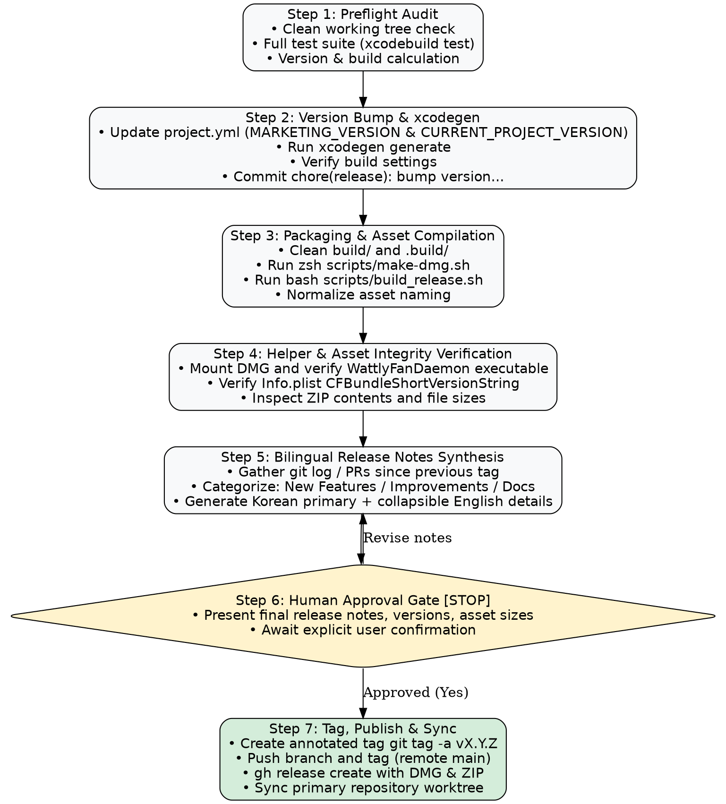

# Wattly Release Automation Skill Design (`wattly-release`)

## 1. Overview & Motivation

Project Wattly is a native macOS menu bar utility for battery charge limits, discharging, and fan control. Due to its hardware-level interaction with Apple Silicon SMC registers and battery management systems, releasing a new version requires rigorous preflight testing, building distribution assets (DMG and ZIP), embedding and verifying the privileged helper daemon (`WattlyFanDaemon`), compiling bilingual release notes, and managing multi-worktree git operations safely.

During the v1.1.0 release, this multi-step process was successfully executed and validated. The `wattly-release` skill codifies this entire pipeline into a reproducible, project-level custom skill that automates mechanical tasks while maintaining strict human-in-the-loop approval gates before public release.

---

## 2. Skill Architecture & Placement

### 2.1 Storage Location
- **Path**: `.agents/skills/wattly-release/SKILL.md`
- **Scope**: Repository-level (`project_wattly`). Checked into version control so any workspace, worktree, or contributor automatically inherits the capability.

### 2.2 YAML Frontmatter & Discovery (SDO)
```yaml
---
name: wattly-release
description: Use when the user wants to prepare, package, tag, or publish a new release of Wattly — e.g. "릴리즈 진행해줘", "v1.2.0 배포해줘", "버전 올려서 릴리즈하자", "새 버전 출시해줘", "/wattly-release", or "cut a new Wattly release". Guides version bumping, xcodegen, test verification, DMG/ZIP packaging, daemon integrity checks, bilingual release notes generation, and GitHub release publishing.
---
```

### 2.3 Invocation & Parameter Handling
1. **Explicit Version Given**: (e.g. `/wattly-release 1.2.0` or `"1.2.0으로 릴리즈해줘"`)
   - `MARKETING_VERSION`: `"1.2.0"`
   - `CURRENT_PROJECT_VERSION`: Automatically reads current build number from `project.yml` and increments by 1.
2. **Implicit / Semantic Recommendation**: (e.g. `/wattly-release` or `"릴리즈 진행하자"`)
   - Inspects commits since previous tag (`git describe --tags --abbrev=0`):
     - If `feat:` or breaking changes found -> recommends minor bump (e.g. `1.1.0` -> `1.2.0`).
     - If only `fix:`, `docs:`, `chore:` found -> recommends patch bump (e.g. `1.1.0` -> `1.1.1`).
   - Presents the proposed version and build number to the user for one-line confirmation before mutating files.

---

## 3. End-to-End Execution Pipeline



### Step 1: Preflight Audit
- Ensure git working tree is clean: `git status --porcelain`.
- Check required CLI tools: `gh auth status`, `xcodegen --version`, `xcodebuild -version`.
- Run complete test suite:
  ```bash
  xcodebuild -project Wattly.xcodeproj -scheme Wattly -destination 'platform=macOS' test
  ```
- Abort immediately if any test fails.

### Step 2: Version Bump & Xcode Project Regeneration
- Read current settings from `project.yml:64-65`.
- Update `MARKETING_VERSION` and `CURRENT_PROJECT_VERSION`.
- Regenerate Xcode project:
  ```bash
  /Users/hyunjun_macbook_pro/bin/xcodegen generate || xcodegen generate
  ```
- Verify build settings:
  ```bash
  xcodebuild -project Wattly.xcodeproj -scheme Wattly -showBuildSettings | grep -E "MARKETING_VERSION|CURRENT_PROJECT_VERSION"
  ```
- Commit version bump:
  ```bash
  git commit -am "chore(release): bump version to X.Y.Z (build N)"
  ```

### Step 3: Packaging Distribution Assets
- Clean previous builds: `rm -rf build/ .build/`
- Build DMG:
  ```bash
  zsh scripts/make-dmg.sh
  ```
  Produces `build/Wattly-X.Y.Z.dmg`.
- Build Release bundle and ZIP:
  ```bash
  bash scripts/build_release.sh
  cp build/Release/Wattly.zip build/Wattly-X.Y.Z.zip
  ```
  Produces `build/Wattly-X.Y.Z.zip`.

### Step 4: Asset & Helper Daemon Integrity Check
Wattly requires `Contents/Helpers/WattlyFanDaemon` for SMC communication.
1. **DMG Verification**:
   ```bash
   mkdir -p /tmp/wattly_mnt
   hdiutil attach build/Wattly-X.Y.Z.dmg -mountpoint /tmp/wattly_mnt -nobrowse -quiet
   test -x "/tmp/wattly_mnt/Wattly.app/Contents/Helpers/WattlyFanDaemon"
   defaults read "/tmp/wattly_mnt/Wattly.app/Contents/Info.plist" CFBundleShortVersionString
   hdiutil detach /tmp/wattly_mnt -quiet
   rmdir /tmp/wattly_mnt
   ```
2. **ZIP Verification**:
   ```bash
   unzip -l build/Wattly-X.Y.Z.zip | grep "Contents/Helpers/WattlyFanDaemon"
   ```
3. **Asset Size Sanity**:
   - Both DMG and ZIP must be within 5MB~15MB range.

### Step 5: Bilingual Release Notes Synthesis
- Extract log:
  ```bash
  PREV_TAG=$(git describe --tags --abbrev=0)
  git log ${PREV_TAG}..HEAD --oneline
  ```
- Generate bilingual markdown:
  - Header: `## Wattly vX.Y.Z 출시 안내`
  - Korean sections:
    - 🚀 주요 신규 기능 (Key Features)
    - 🛠 버그 수정 및 최적화 (Bug Fixes & Improvements)
    - 📦 다운로드 및 설치 (Download & Installation)
  - English section enclosed in collapsible markdown:
    ```markdown
    <details>
    <summary><b>English Release Notes (Click to expand)</b></summary>

    ### Wattly vX.Y.Z Release Notes
    ...
    </details>
    ```

### Step 6: Human Approval Gate (Hard Stop)
- The agent outputs:
  1. Release version and tag (`vX.Y.Z`)
  2. Asset table with sizes and verification status
  3. Full formatted release notes preview
- **STOPS completely and prompts the user**:
  > "이상의 릴리즈 노트와 아티팩트로 vX.Y.Z 태그를 푸시하고 GitHub Release를 발행하시겠습니까? (Yes/No/수정 요청)"
- Only upon explicit user confirmation does the agent proceed to Step 7.

### Step 7: Tag, Publish & Git Sync
1. Create annotated tag:
   ```bash
   git tag -a vX.Y.Z -m "Wattly vX.Y.Z"
   ```
2. Push branch and tag:
   - If on release branch: `git push origin HEAD:main && git push origin vX.Y.Z`
   - If on `main`: `git push origin main && git push origin vX.Y.Z`
3. Publish GitHub Release:
   ```bash
   gh release create vX.Y.Z \
     build/Wattly-X.Y.Z.dmg \
     build/Wattly-X.Y.Z.zip \
     --title "Wattly vX.Y.Z" \
     --notes-file /tmp/wattly_release_notes.md
   ```
4. Worktree sync:
   ```bash
   PRIMARY_REPO="/Users/hyunjun_macbook_pro/Documents/Project/project_wattly"
   if [ -d "$PRIMARY_REPO/.git" ]; then
     git -C "$PRIMARY_REPO" pull origin main
   fi
   ```

---

## 4. Multi-Worktree Safety Protocol

When operating within an isolated git worktree (such as Antigravity session worktrees):
1. **Branch Collision Avoidance**: Never attempt `git checkout main` inside a secondary worktree if `main` is checked out in the primary working tree.
2. **Direct Remote Push**: Push the current HEAD directly to remote `main`: `git push origin HEAD:main`.
3. **Primary Sync**: Safely update the primary working tree using `git -C <path> pull origin main` without disturbing uncommitted changes.

---

## 5. Error Handling & Rollback Matrix

| Failure Stage | Error Scenario | Resolution / Rollback Action |
|---|---|---|
| Step 1 (Preflight) | Test failure or dirty worktree | Abort immediately. Zero files touched. |
| Step 2 (Bump) | `xcodegen` failure | Revert `project.yml` via `git checkout -- project.yml Wattly.xcodeproj`. |
| Step 3/4 (Packaging) | Build script failure or missing daemon | Clean `build/`. Tag is not created. Provide error logs to user. |
| Step 6 (Gate) | User requests changes or cancels | Revise notes or roll back version bump commit (`git reset --soft HEAD~1`). |
| Step 7 (Publish) | `gh release create` network timeout | Provide idempotent retry command: `gh release create vX.Y.Z ...` without rebuild. |

---

## 6. Verification & Self-Review

1. **Placeholder Scan**: No TODOs, TBDs, or ambiguous steps remain.
2. **Internal Consistency**: Matches the exact successful release execution from v1.1.0.
3. **Scope Check**: Well-bounded single skill runbook in `.agents/skills/wattly-release/SKILL.md`.
4. **Tool Compatibility**: Compatible with macOS, Antigravity skill system, Xcode 16+, and GitHub CLI.
